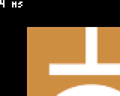
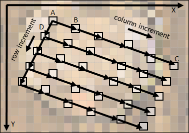
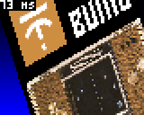
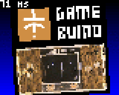
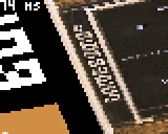
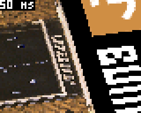
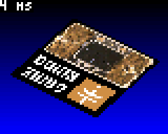
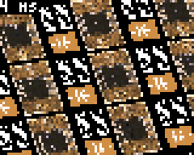

# Affine: Full-screen picture zoom and rotation

## Introduction

In this tutorial we will learn how to display a picture on the screen after an "[affine transformation](https://en.wikipedia.org/wiki/Affine_transformation)" including scale, shear and rotation. Different optimization techniques are used to speed up the display. Such an effect can be used in a game as a splash screen or as a rotating play field.

Download and install the `.bin` file to see the different steps of the implementation (just press A/B to switch between steps).

## Part 1: Setup

This first part is just about importing the picture into the sketch and display how many milliseconds are necessary for a draw with the `drawImage` function of the Gamebuino library.

### Import the picture

First of all we need a picture to display. I built the following picture based on graphics of the Gamebuino web-site (so it can be used for marketing and there is no discussion about copyright!), but you can use any picture you want. To use the full set of optimizations presented in this tutorial, the picture needs to be a square of __256x256__ pixels, but the technique can be adapted to other picture sizes (preferably powers of 2).

Rename the picture as "Picture.bmp" and then use the [image-to-code converter](https://gamebuino.com/creations/png-to-code) to get a long text defining a data array and an Image object. The conversion may take some seconds to complete due to the size of the picture.

Create a new sketch (or use an existing one if you know what you are doing), and insert the code. Then add the classical Gamebuino code, and display the picture using `DrawImage` to see if everything is correctly setup.

The code should look like this (the line with `PictureData` is truncated on purpose, otherwise it would take the whole page):

```C++
#include <Gamebuino-Meta.h>

const uint16_t PictureData[] = {256,256,1, 1, 0, 0, 0x0,0x0,0x0,0x0,0x0,0x0,0x0,0x0,0x0,0x0,0x0,0x0,0x0,0x0,0x0,0x0,0x0,0x0,0x0,0x0,0x0,0x0,0x0,0x0,0..... [snip]
Image Picture = Image(PictureData);

void setup()
{
  // Starts Gamebuino library and sets target frame rate
  gb.begin();
  gb.setFrameRate(50);
}

void loop()
{
  while(!gb.update());

  gb.display.drawImage(0, 0, Picture);
}
```

Please note that the `setFrameRate` command sets already the target frame rate, which will be reached at the end of the tutorial.

At this point, executing the sketch should display the top-left part of the picture:



### Measure the duration of the draw

We are looking for performance in this tutorial, so we need to  measure how long it takes to draw the picture, and hence assess the effect of each optimization. This measurement is not necessary for the zoom/rotation effect, it is implemented only for didactic purposes. You can jump to the next chapter if you want.

To measure the time we use the function [`millis()`](https://www.arduino.cc/reference/en/language/functions/time/millis/) of the Arduino library, which returns the number of milliseconds since the start of the current program.

Insert the measurement of the start time just under the `while(!gb.update());` line:

```C++
  // Gets the time at start of the computation
  unsigned long startTime = millis();
```

And insert the computation and display of the duration at the end of the `loop()` function:

```C++
  // Computes and displays duration
  unsigned long duration = millis()-startTime;
  gb.display.clearTextVars();
  gb.display.setColor(WHITE, BLACK);
  gb.display.print(duration); gb.display.print(" ms");
```

The number is in milliseconds, draw on a non-transparent background for readability. Now the setup is completed, you should see something like this on the screen:

Time to jump to the next part and discover the draw concepts.


## Part 2: Slow draw using float-based computation

This step presents the general idea of the draw technique and a first, non-optimized implementation.

### General idea

To display a picture to the screen with arbitrary zoom and rotation, two families of algorithms can be used:

1. For each pixel of the source picture, we determine the position and size of this pixel on the screen and draw the pixel at this position 
2. For each pixel of the screen, we determine the color of the pixel in the source image and draw it at the current position on the screen

The method 1 has some drawbacks:

- In case the image covers a few pixels on the screen, the algorithm will anyway look at each pixel in the source picture and often draw several times at the same pixel position on the screen
- If the picture is drawn with a zoom, then gaps will be visible because one pixel in the source picture would need to be drawn as a rectangle on the screen.

You got it, we will use the method 2.

The basic idea here is to start from a point at given coordinates within the picture, and to jump to the next point by adding constant increments to the coordinates.

More precisely, on the following diagram, the algorithm is represented for a screen of 5x4 pixels:



We start at point A and draw the color of A at (0,0) on the screen. Then, for the second point we jump to the next column from A to B and draw the color of B on the screen at (1,0). We do the same on the first row until we reach C, in turn drawn at (4,0) on the screen. Now to go to the next row, we come back to A and jump to D, and so on.

Please note that we have 3 co-existing coordinate systems in the algorithm: the screen, the source picture and the "virtual" picture we want to draw. To be clear in this tutorial we will name the coordinates:

- "column" and "row" in the virtual picture, so AB is the column increment and AD is the row increment
- Uppercase X and Y for the coordinates within the source picture

For commonality with the existing screen coordinate system, the other coordinate systems have the same orientation, i.e. origin at the top-left, X axis pointing to the right and Y axis pointing to the bottom.

The origin, column and row increments have two X and Y components in the 2D source picture, that we will name as following:

 - `originX` and `originY` for the origin, point A on the diagram
 - `columnIncrementX` and `columnIncrementY` for the columns, in the diagram approximately equal to (3.2,1.2)
 - `rowIncrementX` and `rowIncrementY` for the columns, in the diagram approximately equal to (-1.0,2.1)

Last thing to note: the increments have fractional values, not integer values. This is necessary to keep a good precision while drawing. In the next section, these increments will be encoded using the `float` type.


### Implementation with float variables

Let's implement the algorithm. First define constant values for the origin and increments in the `loop()` function, just before the line with `startTime = millis()`. The constant values are given here as an example to display a portion of the source picture:

```C++
  // Coordinates of the first point to draw
  float originX=10;
  float originY=10;

  // Column increment
  float columnIncrementX = 3.2;
  float columnIncrementY = 1.2;

  // Row increment
  float rowIncrementX = -1.0;
  float rowIncrementY =  2.1;
```

Then **replace** the line `gb.display.drawImage(0, 0, Picture);` by the following lines to implement the complete algorithm with floats. The variables `startX` and `startY` contain the coordinates of the first point of a row, `X` and `Y` the coordinates of the current point within the source picture and `px` and `py` the coordinates of the current point on the screen:

```C++
      // Inits the counters and perform loop
      float startX=originX, startY=originY, X, Y;
      for(int py=0; py<64; py++)
      {
        X=startX;
        Y=startY;
        Color background = gb.createColor(0, 0, py*4);
        for(int px=0; px<80; px++)
        {
          int intx = (int)X;
          int inty = (int)Y;
          if(intx<0 || intx>255 || inty<0 || inty>255)
            gb.display.drawPixel(px, py, background);
          else
            gb.display.drawPixel(px, py, Picture.getPixelColor(intx, inty));
    
          X+=columnIncrementX;
          Y+=columnIncrementY;
        }
        startX+=rowIncrementX;
        startY+=rowIncrementY;
      }
```

First, as you can see, we simply use the functions `drawPixel` and `getPixelColor` to transfer the color of the pixel from the source picture to the screen (more on that in the next part).

Second, before getting the pixel color from the source picture, the float coordinates are converted to integers using a cast `(int)X`, and the resulting position is then checked to ensure that it is in the source picture. If not, a simple shade is displayed as background color. As a remark, if we do not check the position, then at some point a fatal error is raised because the `getPixelColor` function tries to pick a pixel in some random memory area that is not accessible to the processor.

Time to execute and have a look at the generated picture, which should look like this:



## Part 3: Animation and first optimizations

At this point we are able to draw the picture according to constant increments. In this part we will add animation and start to optimize.

### Animation

Well, now we can draw the picture, it is not very quick but it works (trust me, it will get faster in the next parts). We know that we can modify the origin and the increments vectors to change the viewpoint of the observer, but how?

First of all, we want to center the draw on the center of the source picture. The vectors are inter-dependent so we will need some basic equations (maths are useful after all!).

More precisely, when we draw the pixel at the center of the screen at (40,32), we should be at the position (128,128) in the source picture. According to the draw algorithm (look at the diagram), this point is reached on the row 32 (so after adding 32 times the rowIncrement vector to the origin) and the column 40 (so after adding 40 times the columnIncrement vector to the origin).

In the form of equations projected on the X and Y axes, it looks like:

- originX + 40\*columnIncrementX + 32\*rowIncrementX = 128
- originY + 40\*columnIncrementY + 32\*rowIncrementY = 128

The resolution to compute the origin from the increments is immediate:

- originX = 128 - 40\*columnIncrementX - 32\*rowIncrementX
- originY = 128 - 40\*columnIncrementY - 32\*rowIncrementY

Now we have the origin and need to compute the increments. We want a simple rotation, i.e. we have to define rotating increments vectors, and such that the column and row increment vectors are perpendicular. 

Classically, the trigonometric functions sine and cosine are used for this purpose. These functions oscillate between -1 and 1 with a period of 2\*PI. To draw a circle centered on the origin, if t is varying between 0 and 2\*PI, the successive points (x,y) on the circle of radius R are located at the coordinates:

- x = R\*cos(t)
- y = R\*sin(t)

The increments vectors will be computed exactly as a point on a circle (the vector from the center to the point on the circle is indeed rotating as t increases):

- columnIncrementX = R\*cos(t)
- columnIncrementY = R\*sin(t)

For the row increment vector, this is the same with an added angle of 90 degrees, i.e. PI/2 in radians: 

- rowIncrementX = R\*cos(t + PI/2)
- rowIncrementY = R\*sin(t + PI/2)

We will define a radius of 1 and use as variable varying with the time a new variable `angle` incremented by 2*PI/100 at each frame, hence after 100 frames the cycle will be completed.

The basics are known, so let's go to the implementation.

First define the new **global** variable called `angle` before the `loop()` function:

```C++
// Increasing angle to set observer's position
float angle=0.0;
```

The angle needs to be increased at each frame. Add these lines at the beginning of the `loop()` function:

```C++
  // Increments angle
  angle = angle + 2*3.1416/100;
```

**Re-write** the following lines such that the increments follow circles of radius 4, and the origin is computed as described above:

```C++
  // Increments to go to next column (increment on x on drawn image)
  float columnIncrementX = 4*cos(angle);
  float columnIncrementY = 4*sin(angle);

  // Increments to go to next row (increment on y on drawn image)
  float rowIncrementX = 4*cos(angle+3.1416/2);
  float rowIncrementY = 4*sin(angle+3.1416/2);

  // Coordinates of the first point to draw
  float originX=128-40*columnIncrementX-32*rowIncrementX;
  float originY=128-40*columnIncrementY-32*rowIncrementY;
```

With these settings, the animation should look like this:



Finally, to make the animation a little more interesting, let's add an oscillating zoom and a 3D-like effect. We will define a new `zoom` variable that oscillates with a frequency different than the one for the rotation (here we just use a sine function with the `angle` divided by an arbitrary value). The variable `zoom` is in turn used as a factor on the length of the row and column increments, such that it gives an effect of zoom in/out oscillation. In addition, we reduce the radius of the column increment to give a 3D isometric effect.

For the implementation, add the `zoom` definition and **re-write** the lines defining the increments:

```C++
  // Computes zoom level
  float zoom =  2.2 + 2*sin(angle/1.618);
  
  // Increments to go to next column (increment on x on drawn image)
  float columnIncrementX=zoom*2*cos(angle);
  float columnIncrementY=zoom*2*sin(angle);

  // Increments to go to next row (increment on y on drawn image)
  float rowIncrementX=zoom*3*cos(angle+3.1416/2);
  float rowIncrementY=zoom*3*sin(angle+3.1416/2);
```

Do not hesitate to experiment a lot with these settings! You can change the factors or the functions to create different effects.

Now the animation should look like this:

Well, not bad after all, but still not very fast to draw. Optimizations will be introduced in the next section.

### Optimization of getPixelColor

The idea of the first optimization is to replace the getPixelColor function by a direct access to the memory. We already check that the coordinates are in the range [0..255], so it is safe to pick the pixel color directly. 

The data of the source picture is stored in the flash memory as a constant array PictureData. It starts with 6 `uint16_t` values that we do not need, after this header it is a one-dimensional array. A pixel at position x,y is stored at the offset 6+y+x*256 (the multiplication by 256 can be written as well as a bit shift of 8 bits).

So **re-write** the following line in the draw algorithm to replace the `getPixelColor` function:

```C++
gb.display.drawPixel(px, py, (Color)PictureData[6+intx+(inty<<8)]);
```

The cast to `(Color)` is necessary as a formal type conversion, there is no data conversion.

Once optimized, the result is just a little bit quicker:



### Optimization of drawPixel

Here again, we want to replace a function by a direct access to the memory. Looking at the [header file of Image](https://github.com/Gamebuino/Gamebuino-META/blob/master/src/utility/Graphics/Image.h), it appears that the picture data is contained in a public member of the Image class called `_buffer` of type `uint16_t*` i.e. a pointer on an array of Color pixels, without any header.

The modification is then straightforward. **Re-write** the following lines within the draw algorithm to replace the two occurrences of drawPixel:

```C++
if(intx<0 || intx>255 || inty<0 || inty>255)
  gb.display._buffer[p++] = (uint16_t)background;
else
  gb.display._buffer[p++] = PictureData[6+intx+(inty<<8)];
```

Please note that this optimization is clearly to be put in the "danger zone". As far as I can see, the `_buffer` member is not officially documented and may change without notice, leading to potential incompatibilities in future versions of the Gamebuino API (nevertheless a compiled .bin would work further). This is the price to pay for performance.

Once optimized, the result is as well a bit quicker:



## Part 4: Optimization with fixed-point arithmetic

In this part, we will change small parts of the draw algorithm to increase dramatically the speed.


### Simple 32-bits fixed-point arithmetic without bit shift

The next optimization is more tricky. It relies on fixed-point arithmetic, which is a general-purpose technique to perform computations with fractional numbers, but without using the floating-point types `float` or `double`. The same technique is used, probably among many other creations, in [Fractalino](https://gamebuino.com/creations/fractalino) and in [Raycaster](https://gamebuino.com/creations/raycaster-1).

Understanding the bits and bytes of this technique is not completely mandatory here, and this section much deeper than necessary for the optimization, so you can directly go to the implementation in the next section if you wish.

With [fixed-point arithmetic](https://en.wikipedia.org/wiki/Fixed-point_arithmetic), all fractional numbers are multiplied by a common factor and are stored as integers.

For example, in base 10, let's say that we want to add a=1.3 and b=2.6 taking 10 as our common factor. First convert a and b by multiplying them with the common factor: A=a\*10=13 and B=b\*10=26. Once converted in fixed-point representation, we just add A and B: C=A+B=13+26=39. Finally, we convert the result back: c=C/10=3.9. Here it is easy to see that additions or subtractions of numbers multiplied by a same factor will lead to correct results, we apply just the distributive property.

In base 2 (binary), powers of 2 are used as common factors such that multiplications and divisions can be done as [bit shifts](https://en.wikipedia.org/wiki/Arithmetic_shift). In our examples, we will not use bit shifts, preferring carefully selected access to bytes or words, which are equivalent to multiplying/dividing by factors of 256.

Namely, the processor of the Gamebuino can process 32-bits signed or unsigned integers, and it is always possible to access parts of the 32-bits word, either in two 16-bits words or in 4 bytes.

As an example, if we encode the value 1234.5678 on 32 bits with 16 bits after the dot, the factor is 2^16=65536=256\*256, then 1234.5678\*65536=80908635.3408. The last digits after the dot (.3408) will not be encoded, so we look at the value 80908635=0x04D2915B.

At this point it is very important to mention that the processor of the Gamebuino uses a [little endian](https://en.wikipedia.org/wiki/Endianness) encoding. It means that our value is represented in memory in reverse order i.e. as the sequence { 0x5B, 0x91, 0xD2, 0x04 }.

The different views of the 32 bits in memory are represented below (unsigned values only):

```
             ----- ----- ----- -----
Hexadecimal | 5B  | 91  | D2  | 04  |
             ----- ----- ----- -----
  4 bytes   | 091 | 145 | 210 | 004 |
             ----------- -----------
2 x 16 bits |   37211   |   1234    |
             -----------------------
1 x 32 bits |        80908635       |
             -----------------------
```

Logically, we find the value 1234 (integer part of the value 1234.5678 we encoded) as the second 16-bits integer, and the last byte (here 004) is not zero because 1234 cannot be encoded as one byte (greater than 255). This will be useful to determine if a coordinate is still in the range [0..255] i.e. within the source picture.

The same kind of decomposition can be done for a negative value. Let's look at a new example with the negative value -123.456: -123.456*65536=-8090812.416, we round the value giving -8090812=0xFF848B44 encoded as signed integer.

To give a complete overview (we won't look at all numbers!), the different interpretations of the 32 bits according to different data types, signed or not, are depicted below for 0xFF848B44 encoded in little-endian:

```
             ------ ------ ------ ------
Hexadecimal |  44  |  8B  |  84  |  FF  |
             ------ ------ ------ ------
as uint8_t  |  068 |  139 |  132 |  255 |
             ------ ------ ------ ------
as  int8_t  | -188 |  117 | -124 | -001 |
             ------------- -------------
as uint16_t |    35652    |    65412    |
             ------------- -------------
as  int16_t |   -29884    |     -124    |
             ---------------------------
as  int32_t |         -8090812          |
             ---------------------------
```

The interpretation is complicated in this case. The main thing we need to check is the second int16_t equal to -124. We encoded -123.456, so we could expect -123 here. This difference of 1 is strange at first sight but actually logical.

Let's encode 0.0 and decrease it by 0.2 to obtain the equivalent of -0.2: A=0x00000000, 0.2*65536=3276.8 so after rounding B=32769=0x00008001, then A-B=-32769=0xFFFF7FFF. We see that to encode -0.2, the most-significant byte of the integer part is equal to 0xFF=-1 (second byte here, would be the third byte in little-endian), not zero although we encode -0.2. Intuitively it cannot be 0 because it would mean that +0.1 and -0.1 would be encoded with the same most-significant byte.

Actually it can be interpreted as following: when a value W is separated into its 2 parts W=M\*256+L, the most-significant part M is the next lower multiple (of 256), and the least-significant part L is added to it. It is obvious with positive values, e.g. for 260 the next lower multiple is 1\*256 (so M=0x01) and the value 4 is added (so L=0x04, A=0x0104). This is the same with negative values, e.g. for -260, the next lower multiple is (-2)\*256=-512 (M=0xFE) and the value 512-260=252 (L=0xFC) is added to it (so M=0xFEFC). Strange but it works. 

To come back to our first example, the value 0xFF84=(-1)\*256+132=-124. To re-construct the number correctly, we have to interpret the most-significant byte as signed and the least-significant ones as unsigned. The same to reconstruct the fractional number, we interpret the integer part as signed (most-significant) and the fractional part as unsigned: 0xFF848B44/65536=-124+35652/65536=-123.45599 (precision was lost at the beginning while rounding).

Fixed-point arithmetic work as well for multiplication and division, but it is another story. The main limitation of the technique is of course that it will completely fail if the result of some operations exceeds the maximum value (here -32768 or +32767), even temporarily.

### Implementation of the optimization with fixed-point numbers

After the long deep-dive into fixed-point arithmetic of the previous section, let's summarize and remember that for fixed-point numbers on 32 bits, 16 bits after the dot:

- We define the factor F=256*256=65536 (it corresponds to a shift of 16 bits due to the 16 bits after the dot)
- A negative or positive float n is encoded as fixed-point using N=(int32_t)round(n*F)
- Numbers encoded as fixed-point can be added or subtracted just like large integers, resulting in encoded numbers (actually all operations are possible with more complex formulas)
- An encoded number is decoded back to a float with n=(float)N/(float)F
- To get the fractional or integer parts directly from an encoded number, thanks to our choice of 16 bits after the dot, we can just access the data differently, i.e. as 16-bits integer or bytes, instead of performing conversions or bit shifts
- When accessing different parts of the 32 bits, it is important to interpret the most-significant part as signed integer, and the least-significant part as unsigned integer, due to the encoding of negative values
- Data is encoded in "little-endian" on the Gamebuino, i.e. the number 0x01234567 is represented in memory as { 0x67, 0x45, 0x23, 0x01 }

In C and C++, the data structure `union` can be used to access the same memory location with different types.

Insert the following global type definition, which gives a full access as different types (not all types will be used):

```C++
union FixedPoint
{
  int32_t  asInt32;
  int16_t  asInt16[2];
  uint16_t asUInt16[2];
  int8_t   asInt8[4];
  uint8_t  asUInt8[4];
};
```

Then, **re-write** first the complete draw code as following, first with the definition of the counters and the conversion from floats:

```C++
      // Defines the increments as FixedPoint types and convert values from floats
      FixedPoint columnIncrementFPX, columnIncrementFPY, rowIncrementFPX, rowIncrementFPY;
      columnIncrementFPX.asInt32 = (int32_t)round(columnIncrementX*65536.0);
      columnIncrementFPY.asInt32 = (int32_t)round(columnIncrementY*65536.0);
      rowIncrementFPX.asInt32 = (int32_t)round(rowIncrementX*65536.0);
      rowIncrementFPY.asInt32 = (int32_t)round(rowIncrementY*65536.0);

      // Inits the counters as FixedPoint types and converts values from floats
      FixedPoint startX, startY, X, Y;
      startX.asInt32 = (int32_t)round(originX*65536.0);
      startY.asInt32 = (int32_t)round(originY*65536.0);
```

Second, re-write the main loop as following:

```C++
      // Performs loop
      int p=0;
      for(int py=0; py<64; py++)
      {
        X.asInt32 = startX.asInt32;
        Y.asInt32 = startY.asInt32;
        Color background = gb.createColor(0,0,py*4);
        for(int px=0; px<80; px++)
        {
          int intx = X.asInt16[1];
          int inty = Y.asInt16[1];
          if(intx<0 || intx>255 || inty<0 || inty>255)
            gb.display._buffer[p++] = (uint16_t)background;
          else
            gb.display._buffer[p++] = PictureData[6+intx+(inty<<8)];
    
          X.asInt32 += columnIncrementFPX.asInt32;
          Y.asInt32 += columnIncrementFPY.asInt32;
        }
        startX.asInt32 += rowIncrementFPX.asInt32;
        startY.asInt32 += rowIncrementFPY.asInt32;
      }
```

Note that:

- The coordinates within the picture, intx and inty, are directly extracted from the integer parts (signed) of the current coordinates X and Y.
- The addition of the increments are performed classically on 32 bits, adding the integer and fractional parts of the encoded numbers in one operation

The speed increase is astonishing:




### Infinite Picture

A variant of the previous optimization can be done by re-writing the lines that define intx and inty, check the coordinates and write the pixels as following:
```C++
          if(X.asInt8[3]!=0 || Y.asInt8[3]!=0)
            gb.display._buffer[p++] = (uint16_t)background;
          else
            gb.display._buffer[p++] = PictureData[6+X.asUInt8[2]+(Y.asUInt8[2]<<8)];
```
Worth mentioning that we use directly the bytes of the integer part of the current position:

- There is no comparison any more of x and y, we just use the most-significant byte and check if it equals zero: `if(X.asInt8[3]!=0 || Y.asInt8[3]!=0)`. This is only possible due to the choice of a picture of 256x256 pixels, if the most-significant byte equals zero the value if automatically positive and less than 256.
- We use directly and only the least-significant byte, obviously in range [0..255], to compute the pixel position within the source picture.

The performance increase of this optimization is marginal, but it paves the way for another effect: as we now use directly an unsigned byte for each coordinate within the source picture, we are sure to be inside the picture so it is safe to remove the test. By doing so, due to the nature of the computation, it is like drawing the picture with coordinates modulo 256.

Comment out these lines as following:

```C++
          //if(X.asInt8[3]!=0 || Y.asInt8[3]!=0)
            //gb.display._buffer[p++] = (uint16_t)background;
          //else
```

At the end, the result should look like an infinite tiling of the source picture:




## Conclusion

I hope you enjoyed this tutorial, learned the basics of displaying pixels after a simple transformation, and how to optimize such a draw technique. The result is very fast and could be used out-of-the-box for a game, as long as not too much additional data is necessary (the picture itself uses half of the available flash memory)!.

The strict affine transformation is completed. Possible next steps would be to:

- Apply the same technique on a tile-map instead of a bitmap such that more flash memory remains available. With carefully chosen tile size and map size, bit-shits can be used to build the location of the source pixel in a tile.
- Switch to high-definition using the [high-definition display method by aoneill](https://gamebuino.com/creations/high-resolution-without-gb-display). At the end we are at about 3-4 milliseconds to draw. Optimistically a draw of 4 times the number of pixels in less than 20 milliseconds seems reachable.
- Add a variant of drawImage with integrated rotation and sscale for any picture 
- Use 3D projection formulas and modify the increments at each drawn line to mimic the [Mode 7 of the SNES](https://en.wikipedia.org/wiki/Mode_7). Actually, if you download and install the .bin file, there is a "hidden level" with 3D projection and animation (hopefully for a future tutorial).

That's all folks!
