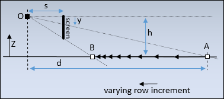
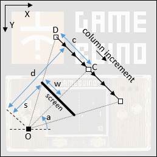

# Affine3D


## Introduction


## Part 1: Setup


## Part 2: Non-affine deformation


## Part 3: Non-optimized 3D projection

Let's now try to do something more useful with the draw function: simulate a 3D view of the source picture.

So we consider an observer at **O** looking down to the picture through a **screen** such that the top of the screen is located at the same height as the observer, here seen from the right:



The observer will see the first line of the picture at **A** and the last line at **B**. From A to B, due to the perspective, the distance decreases between successive drawn lines (i.e. objects appear smaller when they are farer). So the _row increment_, as named in the first Affine tutorial, is not constant during the draw.

Please note that, at the very top of the screen, the observer looks to the infinite and its line of sight will not cross the source picture. Furthermore, the first lines at the top of the screen will show the picture at such a distance that it is no use  drawing them. A kind of "moire" effect can be expected here. A consequence of these remarks is that we will skip the top lines during the draw.

We define the following parameters (all positive):

- _s_ : Distance between the observer and the screen
- _h_ : Height of the observer, i.e. distance between the observer and the plane containing the source picture
- _y_ : Coordinate on the screen of the row of pixels being drawn
- _d_ : Distance between observer and point in the source picture being drawn (projected in the plane containing the source picture)

We can derive a first equation from this view. It is noticeable that the line from observer to top of screen and the plane containing the source picture are parallel, and the line OA crosses them. As a result, the triangles formed by a segment of the line OA, one of the parallel horizontal lines and one vertical lines are right triangles and are all similar. The ratios of the length of their edges are equal, in particular:

    s/y = d/h

Seen from the top, the rotating observer at **O** sees the picture through the screen at **C** on the source picture when looking at the middle of the screen, and at **D** when looking at the left edge of the screen:



We define the following additional parameters (all positive):

- _w_ : Half-width of the screen
- _c_ : Half-length of a straight-line read from the source picture
- _a_ : Angle of the view direction of the observer in the plane containing the source picture

Here again we can notice similar triangles in OCD and equal ratios, in particular:

    w/s = c/d

This equation shows very clearly the proportional relationship between pixel coordinates on a row and the positions on the line DC. In other words, it shows that the "column increment" is constant during the draw and that we can use a row draw function with constant column increment.

Now, the next step is to determine the position in the source picture of the start point of each row to draw, and the corresponding column increment. The start point is D on the picture, and the column increment can be deduced from DC.

Classically, we use trigonometry to calculate the coordinates of D by projecting the components on each axis. If O has the coordinates _(Ox,Oy)_ and D has _(Dx,Dy)_, using the parameters as previously defined and the (inverted) coordinate system shown on the diagram, we go from O to D through the vectors OC and CD:

    Dx = Ox + d*cos(a) - c*sin(a)
    Dy = Oy - d*sin(a) - c*cos(a)

The column increment with coordinates _(Ix,Iy)_ can be calculated as the vector DC divided by _w_, number of pixels to draw:

    Ix = c*sin(a)/w
    Iy = c*cos(a)/w

We have now the basic formulas but _c_ and _d_ are still unknown, so we need to re-use the equations found previously.

    d = s*h/y
    c = d*w/s = (s*h/y)*w/s = w*h/y

And finally:

    Dx = Ox + s*h*cos(a)/y - w*h*sin(a)/y
    Dy = Oy - s*h*sin(a)/y - w*h*cos(a)/y
    Ix = h*sin(a)/y
    Iy = h*cos(a)/y


## Part 4: Optimization with fixed-point computation

As a reminder, to encode a floating-point value into a fixed-point integer value we shift the bits to the left, or multiply by a power of 2, such that the fractional part moves to the integer part. Then we convert to an integer, removing the fractional part. For example,  if `aFP` is the encoded value of `a`, with 16 bits precision after the dot:

```C++
aFP.asInt32 = (int32_t)(65536.0*a);
```

In this section we will use capital letters for fixed-point encoded values, and small letters for their float equivalents. We will also consider that the remaining fractional part, cut while converting to an integer, is neglectible. As a result, we do not need to take the integer conversion into account.

So if we name `F` the factor power of 2 used for conversion (here equal to 65536), we can define the 3 variables encoded as fixed-point values:

    A = a*F
    B = b*F
    C = c*F

Let's look at the **Multiplication of fixed-point values**. We search `C`, encoded value of `c`, such that:

    c = a * b

After replacements:

    c = C/F = A/F * B/F

Or:

    C = A * B / F

It means that after multiplying the 2 integer values, we need to shift the result to re-align it to the dot. This implies that the result of `A * B` is encoded on 64 bits.

There is a trick to perform just a 32-bits multiplication, even if we lose some precision: before the multiplication, we can pre-shift `A` and `B`. I used that in Fractalino. Let's define `G` as the factor representing a half-shift (here it is equal to 256), i.e. such that:

    F = G*G

Replacing it in the multiplication formula:

    C = (A/G) * (B/G)

Mathematically it makes no difference, but allows to first shift our values to 16-bits integers, losing the most-significant bits that would anyway overflow, and then multiply and get directly the 32-bits value.

Now let's look at the **division of fixed-point values**. We search `C`, encoded value of `c`, such that:

    c = a / b

After replacements:

    c = C/F = A/B

Or:

    C = (A * F) / B

It means that before dividing, we need to pre-shift `A` on 64 bits.


