# Affine3D

This tutorial follows the first [Affine tutorial](https://gamebuino.com/community/topic/affine-full-screen-picture-zoom-and-rotation), where we saw how to display a full-screen picture with zoom and rotation.

Here we will see how to re-use the same concepts to display a picture with a 3D effect, then do the same with a tile-map and finally design a mini kart game.

## Introduction

The [Mode 7](https://en.wikipedia.org/wiki/Mode_7) is famous in the world of gaming. With this feature, Nintendo introduced a hardware-based image transformation engine able to support a wide range of 3D effects [used in various games](https://www.youtube.com/watch?v=Z_3clFDpXrg). The idea here is to re-implement something similar on the Gamebuino.

The first Affine tutorial was limited to true [affine transformations](https://en.wikipedia.org/wiki/Affine_transformation) allowing zoom, rotation and shear.

The trick in this tutorial is to **display an image through an affine transformation but change the transformation parameters for each row of pixels**.

Let's start.

## Part 1: Setup

Like in the first tutorial we will start with an image of 256x256 pixels:

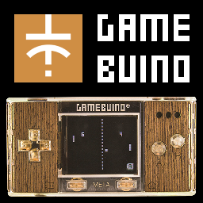

So create a new sketch and use the [image transcoder](https://gamebuino.com/creations/image-transcoder) to transform it into code in mode RGB565, calling it "`Picture`". At the beginning of the .ino file, you should now have something like this (shortened here):

```C++
#include <Gamebuino-Meta.h>

const uint16_t PictureData[] = {256,256,1, 1, 0, 0, 0x0,0x0,0x0,0x0,0x0,...
```

After that, we add some basic code like in the Affine tutorial to:

- Init everything with `gb.begin()` and framerate setting in the `setup()` function
- Wait for screen update, measure the duration of the draw code and display this duration in microseconds on the screen, in the `loop()` function. Note that printing the string `\xB5` displays actually the greek Mu letter.

```C++
void setup()
{
  // Starts Gamebuino library and sets target frame rate
  gb.begin();
  gb.setFrameRate(50);
}

// Time measurement variable
unsigned long previousStartTime = micros();

void loop()
{
  // Waits for screen refresh
  while(!gb.update());

  // Gets the time at start of the computation
  unsigned long startTime = micros();

  // ...

  // Computes and displays duration
  unsigned long duration = micros()-startTime;
  gb.display.clearTextVars();
  gb.display.setColor(WHITE, BLACK);
  gb.display.print(duration); gb.display.print(" \xB5s");
}
```

## Part 2: Fixed-point arithmetic macros

In order to improve the readability of the code, we will use macros to perform [fixed-point arithmetic](https://en.wikipedia.org/wiki/Fixed-point_arithmetic). Refer to the [Affine tutorial](https://gamebuino.com/community/topic/affine-full-screen-picture-zoom-and-rotation) for fixed-point arithmetic basics.

This code goes at the top of the sketch file.

First of all, we define a new data type for our base fixed-point type, i.e. we will use `FP32` as type for the variable carying a fixed-point value. Unlike in the Affine tutorial, this basic type is not a `union`:

```C++
// Definition of 32-bits fixed-point type for better readability
typedef int32_t FP32;
```

Then we define a macro for conversion from a float to a fixed-point value (instead of writing the same syntax again and again). We use 32-bits fixed-point values, with 16 bits before the dot and 16 bits after the dot. The transformation if done by multiplying the float value by the 2^16=65536 in order to shift the bits to the left, and then to convert the result to an integer to keep only the integer value:

```C++
// FP32 macro to convert from float to FP32
#define FP32_FROM_FLOAT(a) ( (FP32) (65536.0*(a)) )
```

ATTENTION: A macro is not a function. A macro is treated before compilation by the [C preprocessor](https://en.wikipedia.org/wiki/C_preprocessor) and can be seen as a smart text search/replace feature. As an example, here, each time the character string `FP32_FROM_FLOAT(something)` is found in the code, then it gets _replaced_ by `( (FP32) (65536.0*(something)) )`. There is no type or syntax check. It is advisable to use lots of parenthesis in a macro definition to be sure that the replaced string is not interpreted together with surrounding text, leading to strange compilation or run-time errors.

The main advantage of using macros instead of functions is that, after pre-processing, a complex expression remains largely self-contained and does not depend on function calls. Usually, the compiler can better optimize the code if all computation steps are in the same complex expression.

Like in the Affine tutorial, we will need to access different parts of the 32-bits fixed-point values. So we re-use the `union` to access these parts:

```C++
// Defines a union type giving access to the data as 8, 16 or 32 bits integers
union FixedPoint
{
  int32_t  asInt32;
  int16_t  asInt16[2];
  uint16_t asUInt16[2];
  int8_t   asInt8[4];
  uint8_t  asUInt8[4];
};
```

As a side note, it would be possible to access the different parts using bit-shifts and AND/OR operations, but measurements show a better performance by using such a `union` type.

Actually we will not need all members of the `union`. We only need to access the integer part of the fixed-point value, i.e. the 16 most significant bits, and we need to access them in the form of bytes.

So first we define a macro to retrieve the most significant byte of the integer part (taking endianness into account and the strange cast to a `union`):

```C++
// FP32 macro to extract most significant signed byte of the integer part of an FP32 value
//#define FP32_MSBYTE(A) ( (int8_t) ( ((int8_t*)&(A))[3]) )
#define FP32_MSBYTE(A) ( (int8_t) ( (FixedPoint({(A)})).asInt8[3] ) )
```

Second we define a macro to retrieve the least significant byte of the integer part as unsigned byte:

```C++
// FP32 macro to extract least significant unsigned byte of the integer part of an FP32 value
//#define FP32_LSBYTE(A) ( (uint8_t) ( (uint8_t*)&(A))[2] )
#define FP32_LSBYTE(A) ( (uint8_t) ( (FixedPoint({(A)})).asUInt8[2] ) )
```

At this stage a small example is certainly useful. So let's take the value `a=500.5`:

- `a*65536 = A = 32800768`, so `FP32_FROM_FLOAT(500.5)` gives the value `A=32800768` or `0x01F48000` in hexadecimal.
- The hexadecimal view shows clearly the integer part of this value equal to `0x01F4` or `500` in decimal.
- In turn, the most significant byte of the integer part is `0x01` so `FP32_MSBYTE(A)` return `0x01` or `1` in decimal.
- And the least significant byte of the integer part is `0xF4` so `FP32_LSBYTE(A)` return `0xF4` or `244` in decimal (unsigned).

I can imagine that this part is hard to follow. It is not necessary to understand completely the bits and bytes here to understand the rest of the tutorial. Just use the macros definition as provided.

## Part 3: Implementation of the draw procedure

Now that we have a comprehensive set of macros and type definitions, we can re-write the function that draws one row of pixels with an affine transformation.

The goal of this draw procedure is to fill a row of pixels on the screen from left to right, and the color of each pixel is read from a straight line on the source picture starting at a given position `(x,y)`, where `x` and `y` are fixed-point values.

Technically:

- For each pixel to draw on the screen row, the color is read from the source picture at a position equal the the integer parts of `x` and `y`
- Once the pixel is written on the screen, we go to the next pixel to draw, and the values of `x` and `y` are incremented by the fixed-point values `dx` and `dy`, i.e. `x=x+dx` and `y=y+dy`

That's all! It is really just like: take the color at `(x,y)` on the source picture, write the pixel on the screen, then go to the next position on the source picture by adding `(dx,dy)` to `(x,y)`, write the next pixel and so on.

Because the "column increment" `(dx,dy)` is constant, the successive values of `(x,y)` follow a straight line on the source picture.

We will access the screen and the source picture directly in memory. Following the good remarks of [Alban](https://gamebuino.com/@Alban) on the Affine tutorial, we just define the two pointers `Color* source` and `Color* destination` as parameters to the function.

`destination` will point to the current pixel being drawn in the buffer of `gb.display`.

`source` will point to the first pixel of the source picture, and will be used as one-dimensional array.

The main trick of this draw procedure is the choice of the size of the source picture: 256x256. It means that each X and Y coordinate of a pixel fits exactly on one unsigned byte (with a value from 0 to 255), hence:

- If the `x` or `y` coordinate is represented as an `FP32` variable (with a 16-bits integer part), then:
  - If the most significant byte of the integer part is equal to zero, then the coordinate is inside the picture (between _0_ and _255_), e.g. `0x0123=291` is outside (most significant byte is `0x01=FP32_MSBYTE(0x0123)`), `0x00FF=255` is inside (MSB is `0x00`), `0xFFFE=-2` is outside (MSB is `0xFF`). This is why we defined the macro `FP32_MSBYTE`
  - If the `x` and `y` coordinates as `FP32` are between _0.0_ and _255.9999_, we need just to extract the least significant byte of the integer part, e.g. from `(int32_t)(255.9999*65536)=16777215=0x00FFFFFF` the integer part (16 most significant bits) is `0x00FF` and its least significant byte is `0xFF=255=FP32_LSBYTE(16777215)`. This is why we defined the macro `FP32_LSBYTE`
- If we extract the byte values `X=FP32_LSBYTE(x)` and `Y=FP32_LSBYTE(y)`, the offset of the pixel in the source picture is given by `Y*256 + X` or `Y<<8 + X` (because an 8-bits shift is the same as multiplying by 2^8=256).

Tricks with integers and boolean algebra are almost magical! By using powers of 2, mulplications, modulos and divisions become just bit shifting and masking. Such tricks would deserve a specific tutorial.

Time to write the draw procedure. We want to draw exactly 80 pixels on each pixel row. Instead of a loop, we will define again a macro that will repeat the same code 80 times. The definition is straightforward:

```C++
// Macros to repeat 80 times the same text
#define REPEAT20(X) X X X X X X X X X X X X X X X X X X X X
#define REPEAT80(X) REPEAT20(X) REPEAT20(X) REPEAT20(X) REPEAT20(X)
```

Once again, here are the parameters summarized:

- `x` and `y` are FP32 variables pointing to the location in the source picture to take pixels from
- `dx` and `dy` are FP32 variables representing the "column increment"
- `source` is a `Color` array containing the source picture
- `destination` is a `Color*` pointer on the pixel to draw in the screen frame buffer
- `background` is a background color to use in case one of the `x` or `y` coordinate is outside the source picture

Then the main part of the procedure is easily understandable. We repeat 80 times:

- If one of the `x` or `y` coordinates is not pointing inside the picture, then the current pixel at `destination` on the screen receives the `background` color, then `destination` is incremented to move to the next pixel on its right
- Otherwise the current pixel at `destination` receives the color picked from the `source` picture at offset `Y*256+X`, where `X` and `Y` are the least significant bytes of the integer parts of `x` and `y`, then `destination` is incremented
- Finally `x` is incremented by `dx` and `y` by `dy`

As C++ code:

```C++
    REPEAT80(
      if (FP32_MSBYTE(x)!=0 || FP32_MSBYTE(y)!=0)
        *destination++ = background;
      else
        *destination++ = source[ FP32_LSBYTE(x) + (FP32_LSBYTE(y)<<8) ];
      x += dx; y += dy;
    )
```

Like in the Affine tutorial, the boundaries test on the `x` and `y` coordinates can be just ignored. It is safe to use the least significant bytes because their values are automatically between 0 and 255 and hence always correspond to a point in the source picture. The resulting effect is that the picture is displayed as if it would be repeated infinitely in all directions.

We can the define a new boolean `infinite` and write the final version of the draw function (which goes at the beginning of the sketch, after the macros definition):

```C++
// Draws one row of 80 pixels at destination using pixel colors from the source picture
// at (x,y) and incremented at each pixel by (dx, dy)
Color* drawRow(Color* source, Color* destination, FP32 x, FP32 y, FP32 dx, FP32 dy,
               bool infinite=true, Color background=BLACK)
{
  // Repeat 80 times the same instructions without boundaries test if infinite
  if (infinite)
  {
    REPEAT80(
      *destination++ = source[ FP32_LSBYTE(x) + (FP32_LSBYTE(y)<<8) ];
      x += dx; y += dy;
    )
  }

  // Repeat 80 times the same instructions with boundaries test
  else
  {
    REPEAT80(
      if (FP32_MSBYTE(x)!=0 || FP32_MSBYTE(y)!=0)
        *destination++ = background;
      else
        *destination++ = source[ FP32_LSBYTE(x) + (FP32_LSBYTE(y)<<8) ];
      x += dx; y += dy;
    )
  }

  // Returns the last value of destination, now pointing on the first pixel of the next row
  return destination;
}
```

Last remark: the function returns the last computed `destination` value. It is useful because after drawing one line of pixels, it points to the first pixel on the next line.

## Part 3: Picture deformation

Enough theory, after this long reminder of the Affine tutorial, and now that the draw procedure is written, let's see how to play with it!

Before the loop, define a global frame `counter`variable, a global `a` variable used for animation (as angle), and a global `infinite` variable to control if we want to display an infinite picture or not (modify this variable manually as you wish):

```C++
// Frame counter
long int counter=0;

// Main animation variable and view angle
float a;

// Displays infinitely wrapped source picture (boundaries check)
bool infinite=false;
```

Now in the `loop()` function, under the line `unsigned long startTime = micros();`, add the following code to initialize the first values of our pointers, define start values for the positions and increments, increments the counter and give a value to the float variable `a`, which will increase a little at each frame (this variable will be used as angle):

```C++
  // Inits pointers on source and destination pixel arrays
  Color* source = (Color*)(PictureData+6);
  Color* destination = (Color*)(gb.display._buffer);

  // Defines other variables
  Color background;
  FP32 startx, starty, incx, incy;

  // Increments frame counter
  counter += 1;

  // Grows slowly with time
  a = (float)counter/50;
```

Then add the following loop on the successive rows of the screen, which first defines a shaded `background` color, and then inits the start positions and increments to some mathematical functions depending on the new `a` variable (used mainly as angle of trigonometry functions).

I won't explain the formulas, because they were designed with mathematical feeling more than reasoning, just to get something nice to look at!

```C++
      // Loops on each row
      for(int y=0; y<64; y++)
      {
        // Creates background color for this row, blue shade from light to dark
        background = gb.createColor(0,0,(64-y)*4-1);

        startx = FP32_FROM_FLOAT(-50);
        starty = FP32_FROM_FLOAT((float)y*4.0);
        incx =   FP32_FROM_FLOAT((1.5+cos(time+(float)y/20.0))*2.0);
        incy =   FP32_FROM_FLOAT((1.5+sin(time+(float)y/20.0))*2.0);

        destination = drawRow(source, destination, startx, starty, incx, incy, infinite, background);
      }
```

The result is cool, here with picture boundaries check i.e. `infinite=false`:

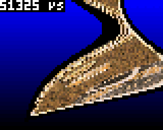

With `infinite=true`:


The performance could be improved, but it is not the focus of this part. We want to concentrate our efforts on 3D!

## Part 4: 3D projection

Let's now try to do something more useful with the draw function: simulate a 3D view of the source picture. In this part we will do the maths.

Again, the principle here is to determine the start position and the increments for each row of pixels.

So we consider an observer at **O** looking down to the picture through a **screen** such that the top of the screen is located at the same height as the observer, here seen from the right:

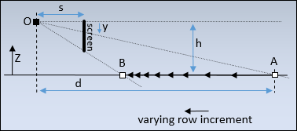

The observer will see the first line of the picture at **A** and the last line at **B**. From A to B, due to the perspective, the distance decreases between successive drawn lines (i.e. objects appear smaller when they are farer). So the _row increment_, as named in the first Affine tutorial, is not constant during the draw.

Please note that, at the very top of the screen, the observer looks to the infinite and its line of sight will not cross the source picture. Furthermore, the first lines at the top of the screen will show the picture at such a distance that it is no use  drawing them. A kind of "moire" effect can be expected here. A consequence of these remarks is that we will skip the top lines during the draw.

We define the following parameters (all positive):

- _s_ : Distance between the observer and the screen
- _h_ : Height of the observer, i.e. distance between the observer and the plane containing the source picture
- _y_ : Coordinate on the screen of the row of pixels being drawn
- _d_ : Distance between observer and point in the source picture being drawn (projected in the plane containing the source picture)

We can derive a first equation from this view. It is noticeable that the line from observer to top of screen and the plane containing the source picture are parallel, and the line OA crosses them. As a result, the triangles formed by a segment of the line OA, one of the parallel horizontal lines and one vertical lines are right triangles and are all similar. The ratios of the length of their edges are equal, in particular:

    s/y = d/h

Seen from the top, the rotating observer at **O** sees the picture through the screen at **C** on the source picture when looking at the middle of the screen, and at **D** when looking at the left edge of the screen:

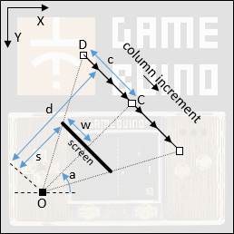

We define the following additional parameters (all positive):

- _w_ : Half-width of the screen
- _c_ : Half-length of a straight-line read from the source picture
- _a_ : Angle of the view direction of the observer in the plane containing the source picture

Here again we can notice similar triangles in OCD and equal ratios, in particular:

    w/s = c/d

This equation shows very clearly the proportional relationship between pixel coordinates on a row and the positions on the line DC. In other words, it shows that the "column increment" is constant during the draw and that we can use a row draw function with constant column increment.

Now, the next step is to determine the position in the source picture of the start point of each row to draw, and the corresponding column increment. The start point is D on the picture, and the column increment can be deduced from DC.

Classically, we use trigonometry to calculate the coordinates of D by projecting the components on each axis. If O has the coordinates _(Ox,Oy)_ and D has _(Dx,Dy)_, using the parameters as previously defined and the (inverted) coordinate system shown on the diagram, we go from O to D through the vectors OC and CD:

    Dx = Ox + d*cos(a) - c*sin(a)
    Dy = Oy - d*sin(a) - c*cos(a)

The column increment with coordinates _(Ix,Iy)_ can be calculated as the vector DC divided by _w_, number of pixels to draw:

    Ix = c*sin(a)/w
    Iy = c*cos(a)/w

We have now the basic formulas but _c_ and _d_ are still unknown, so we need to re-use the equations found previously.

    d = s*h/y
    c = d*w/s = (s*h/y)*w/s = w*h/y

And finally:

    Dx = Ox + s*h*cos(a)/y - w*h*sin(a)/y
    Dy = Oy - s*h*sin(a)/y - w*h*cos(a)/y
    Ix = h*sin(a)/y
    Iy = h*cos(a)/y

The hard part was to determine the formulas. In comparison the implementation is easy.

First add the definition of the 3D view parameters before the `loop()` function, e.g. after the line `bool infinite=false;`:

```C++
// 3D view parameters
float s, h, w, Ox, Oy;
int firstRow = 1;
```

Here `firstRow` gives the row coordinate of the first row where the 3D draw begins. As we saw previously, the formulas will fail if `y` is zero (due to the division by `y`), so we want to draw at a position below the row at `y=0`. `firstRow` will remain constant in the rest of this tutorial, but can be used to reduce the number of drawn lines.

Somewhere in the `loop()` function, before the draw loop, assign values to the parameters. `a` is already set. The `h` parameter follows a sine curve with `a`. Other parameters are fixed. If you want, change the parameter values to see what happens:

```C++
  // Default view values
  s = 100;
  w = 40;
  Ox = 128;
  Oy = 128;
  h = 25+10*sin(a/3);
```

Finally, replace the loop by the following code, which implements the formulas without any further optimization:

```C++
      // Loops on each row
      for(int y=0; y<64; y++)
      {
        // Creates background color for this row, blue shade from light to dark
        background = gb.createColor(0,0,(64-y)*4-1);

        // First lines are filled with background to avoid division by zero and moire effect
        if(y<firstRow)
          for(int px=0; px<80; px++)
            *destination++ = background;
        else
        {
          // Computes start point and increment as floats
          float Dx = Ox + s*h*cos(a)/y - w*h*sin(a)/(float)y;
          float Dy = Oy - s*h*sin(a)/y - w*h*cos(a)/(float)y;
          float Ix = h*sin(a)/(float)y;
          float Iy = h*cos(a)/(float)y;

          // Transforms floats into fixed-point variables
          startx = FP32_FROM_FLOAT(Dx);
          starty = FP32_FROM_FLOAT(Dy);
          incx =   FP32_FROM_FLOAT(Ix);
          incy =   FP32_FROM_FLOAT(Iy);

          // Draws row
          destination = drawRow(source, destination, startx, starty, incx, incy, infinite, background);
        }
      }
```

Note that at the top of the screen, when `y` is lower than `firstRow`, a row of pixels with `background` color is drawn.

The result is as expected, but slow. Here with picture boundaries check:

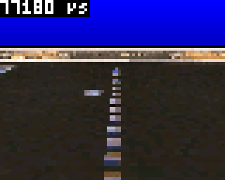

In infinite mode, i.e. without picture boundaries check:

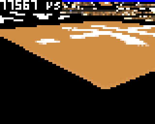


## Part 5: First optimization with floats

The implementation in the previous part is such that the complete formulas are computed at each line. A first obvious optimzation is to separate what can be computed once per frame.

From the part 3, the original formulas are:

    Dx = Ox + s*h*cos(a)/y - w*h*sin(a)/y
    Dy = Oy - s*h*sin(a)/y - w*h*cos(a)/y
    Ix = h*sin(a)/y
    Iy = h*cos(a)/y

All variables are constant for the frame except `y`, so we can simplify.

First let's get the trigonometry values in `sina` and `cosa`:

    sina = sin(a)
    cosa = cos(a)

Then we gather the factors divided by `y`:

    Ax = h*( s*cosa - w*sina)
    Ay = h*(-s*sina - w*cosa)

Such that:

    Dx = Ox + Ax/y
    Dy = Oy + Ay/y
    Ix = h*sina/y
    Iy = h*cosa/y

And then, because division is the slowest operation (following the remarks of Alban), we will prefer to multiply by the invert of `y`, called `factor`.

    factor = 1/y
    Dx = Ox + Ax*factor
    Dy = Oy + Ay*factor

We then avoid one multiplication by pre-multiplying the `factor` by `h` for the computation of `incx` and `incy`:

    factor = factor*h
    Ix = sina*factor
    Iy = cosa*factor

For the implementation, just replace the computation by the following code, which computes directly the fixed-point values:

```C++
          // Computes values for the row
          float factor = 1/(float)y;
          startx = FP32_FROM_FLOAT(Ox + Ax*factor);
          starty = FP32_FROM_FLOAT(Oy + Ay*factor);
          factor *= h;
          incx = FP32_FROM_FLOAT(sina*factor);
          incy = FP32_FROM_FLOAT(cosa*factor);
```

The result is already acceptable, here with picture boundaries check:

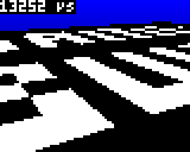

In infinite mode:

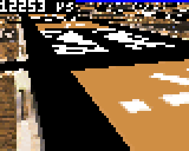

## Part 6: Optimization with fixed-point arithmetic

Now this is a difficult part. To improve the performance further, we can replace the float operations by fixed-point arithmetic. For that, we will have to look at multiplication and division in fixed point. It sounds more difficult than it is in reality.

As a reminder, to encode a floating-point value into a fixed-point integer value we multiply by `F=2^16=65536`, such that the fractional part moves to the integer part. Then we convert to an integer, removing the fractional part.

In this section we will use capital letters for fixed-point encoded values, and small letters for their float equivalents. We will also consider that the remaining fractional part, cut while converting to an integer, is neglectible. As a result, we do not need to take the integer conversion into account.

So if we name `F` the factor power of 2 used for conversion (here equal to 65536), we can define the 3 variables encoded as fixed-point values:

    A = a*F
    B = b*F
    C = c*F

Let's look at the **Multiplication of fixed-point values**. We search `C`, encoded value of `c`, such that:

    c = a * b

After replacements:

    c = C/F = A/F * B/F

Or:

    C = A * B / F

It means that after multiplying the 2 integer values, we need to shift the result to re-align it to the dot. This implies that the result of `A * B` is encoded on 64 bits.

For the implementation of the multiplication of two fixed-point values (already converted):

- First we need to convert the two factors to the `int64_t` type, such that the multiplication itself is done on 64 bits
- Then the multiplication is performed, with a 64-bits result
- Finally a bitshift of 16 bits to the right is applied

For the implementation, add the following macro at the beginning of the .ino file, which reflects exactly these steps:

```C++
// FP32 macro to multiply two FP32 values
#define FP32_MUL(A,B) ( (FP32) (( ((int64_t)(A)) * ((int64_t)(B)) ) >> 16L) )
```

Now let's look at the **division of fixed-point values**. We search `C`, encoded value of `c`, such that:

    c = a / b

After replacements:

    c = C/F = A/B

Or:

    C = (A * F) / B

It means that before dividing, we need to pre-shift `A` on 64 bits.

The steps for the implementation of the division are then very similar to the ones for the multiplication. Add the following macro to the beginning of the .ino file:

```C++
// FP32 macro to divide two FP32 values
#define FP32_DIV(A,B) ( (FP32) (( ((int64_t)(A)) << 16L )/(B)) )
```

Now let's use the macros to adapt the draw loop. First, add the conversion to FP32 of all relevant variables in the `loop()` function, just after the definition of `Ax` and `Ay`:

```C++
  // Inits fixed-point equivalent variables for the frame
  FP32 sinaFP = FP32_FROM_FLOAT(sina);
  FP32 cosaFP = FP32_FROM_FLOAT(cosa);
  FP32 AxFP =   FP32_FROM_FLOAT(Ax);
  FP32 AyFP =   FP32_FROM_FLOAT(Ay);
  FP32 OxFP =   FP32_FROM_FLOAT(Ox);
  FP32 OyFP =   FP32_FROM_FLOAT(Oy);
  FP32 hFP =    FP32_FROM_FLOAT(h);
```

Then replace the computation of `startx` etc in the draw loop:

```C++
          // Computes values for the row
          FP32 factorFP = FP32_DIV(1<<16 , y<<16);
          startx = OxFP + FP32_MUL(AxFP, factorFP);
          starty = OyFP + FP32_MUL(AyFP, factorFP);
          factorFP = FP32_MUL(factorFP, hFP);
          incx = FP32_MUL(sinaFP, factorFP);
          incy = FP32_MUL(cosaFP, factorFP);
```

Note that we convert here `1` and `y` inline, this is the same as using the conversion macro. For this very particular division, which is more an inversion, there are certainly additional simplifications I did not thin about, but this would not change much the final performance.

And the result is incredibly quick!!

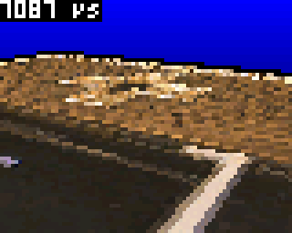

Even better in infinite mode:

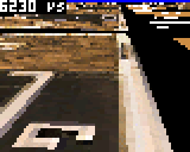

The performance would be even sufficient for a display in high resolution. But well, the main drawback of the technique remains the storage space it requires in the flash memory (half of the total space), and the lack of flexibility.

## Part 7: Tile map setup

The obvious idea now is to replace the 256x256 source picture by a [tile map](https://en.wikipedia.org/wiki/Tiled_rendering). It is more flexible and takes way less storage space.

I designed quickly in [paint.net](https://www.getpaint.net/) this race tile set (hereafter zoomed 3 times). It is not very fancy and the number of tiles is limited but it fulfills the purpose. It contains 8 tiles of 16x16 pixels:

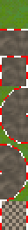

Note that all tiles are arranged vertically. We will see later that it is necessary for better performance. The size of 16x16 is as well important here, but the number of tiles (here 8) is not. The tile set could contain more tiles without any impact on the performance.

Add the code corresponding to this picture at the beginning of the sketch file, after transformation e.g. with the [image transcoder](https://gamebuino.com/creations/image-transcoder) by [Steph](https://gamebuino.com/@Steph), in mode RGB565 (code shortened here):

```C++
const uint16_t raceTileSet[] = {
  16,     // frame width
  16,     // frame height
  8,      // number of frames
  0,      // animation speed
  0xf81f, // transparent color
  0,      // RGB565 color mode
  // frame 1/8
  0x5422, 0x5c05, 0x5c05, 0x5c05, 0x5466, 0x5c05, 0x5466, 0x5c05, 0x5c05, 0x5c05, 0x5466, 0x5422, 0x5422, 0x5403, 0x5c25, 0x5c05, 
  0x5403, 0x5c05, 0x5c05, 0x5c05, 0x5c05, 0x5c05, 0x5422, 0x5c25, 0x5403, 0x5c25, 0x5c05, 0x5c25, 0x5422, 0x5c05, 0x5422, 0x5c05, 
.....
```

Then I used the [Tiled editor](https://www.mapeditor.org/) to build a map. First a tileset must be created (extension `.tsx` in Tiled), then the map can be drawn and saved (extension `tmx` in Tiled). Here is the result:

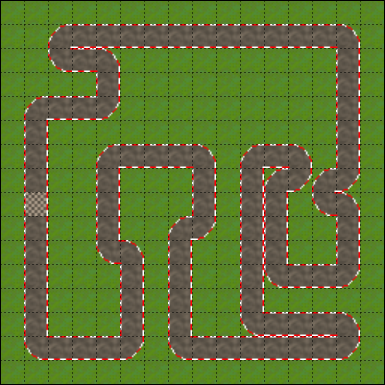

With the default CSV save format of Tiled, the one-dimensional array containing the tile numbers appears clearly in the `.tmx` file:

```XML
  <data encoding="csv">
1,1,1,1,1,1,1,1,1,1,1,1,1,1,1,1,
1,1,4,2,2,2,2,2,2,2,2,2,2,2,6,1,
1,1,5,2,6,1,1,1,1,1,1,1,1,1,3,1,
1,1,1,1,3,1,1,1,1,1,1,1,1,1,3,1,
1,4,2,2,7,1,1,1,1,1,1,1,1,1,3,1,
1,3,1,1,1,1,1,1,1,1,1,1,1,1,3,1,
1,3,1,1,4,2,2,2,6,1,4,2,6,1,3,1,
1,3,1,1,3,1,1,1,3,1,3,4,7,4,7,1,
1,8,1,1,3,1,1,1,3,1,3,3,1,5,6,1,
1,3,1,1,3,1,1,4,7,1,3,3,1,1,3,1,
1,3,1,1,5,6,1,3,1,1,3,3,1,1,3,1,
1,3,1,1,1,3,1,3,1,1,3,5,2,2,7,1,
1,3,1,1,1,3,1,3,1,1,3,1,1,1,1,1,
1,3,1,1,1,3,1,3,1,1,5,2,2,2,6,1,
1,5,2,2,2,7,1,5,2,2,2,2,2,2,7,1,
1,1,1,1,1,1,1,1,1,1,1,1,1,1,1,1
</data>
```

ATTENTION: By convention, in Tiled, the tile number 0 means no tile. In other words, Tiled considers that the first tile has the number 1, and it is unfortunately not possible to change this by configuration.

In our tile set, the very first tile (grass) has the index 0 according to the C/C++ convention. In order to avoid a subtraction at run-time, for performance, we need to decrement all tile numbers. A quick and dirty solution (that I applied here) is to use a text editor to replace "1" by "0", then "2" by "1" and so on. Such a method is possible with a low number of transformations. Of course a little script would be better if Tiled is used frequently.

Another possibility here would be to add another empty tile at the beginning of the tile set.

After adaptation, the array of bytes is named `raceTileMap`. Add this new constant variable at the beginning of the sketch:

```C++
const int8_t raceTileMap[] = {
0,0,0,0,0,0,0,0,0,0,0,0,0,0,0,0,
0,0,3,1,1,1,1,1,1,1,1,1,1,1,5,0,
0,0,4,1,5,0,0,0,0,0,0,0,0,0,2,0,
0,0,0,0,2,0,0,0,0,0,0,0,0,0,2,0,
0,3,1,1,6,0,0,0,0,0,0,0,0,0,2,0,
0,2,0,0,0,0,0,0,0,0,0,0,0,0,2,0,
0,2,0,0,3,1,1,1,5,0,3,1,5,0,2,0,
0,2,0,0,2,0,0,0,2,0,2,3,6,3,6,0,
0,7,0,0,2,0,0,0,2,0,2,2,0,4,5,0,
0,2,0,0,2,0,0,3,6,0,2,2,0,0,2,0,
0,2,0,0,4,5,0,2,0,0,2,2,0,0,2,0,
0,2,0,0,0,2,0,2,0,0,2,4,1,1,6,0,
0,2,0,0,0,2,0,2,0,0,2,0,0,0,0,0,
0,2,0,0,0,2,0,2,0,0,4,1,1,1,5,0,
0,4,1,1,1,6,0,4,1,1,1,1,1,1,6,0,
0,0,0,0,0,0,0,0,0,0,0,0,0,0,0,0
};
```

At the beginning of the `loop()` function, add the aliases for the tile map and tile set raw variables:

```C++
  // Inits pointers for the tile map
  Color* tileset = (Color*)(raceTileSet+6);
  int8_t* tilemap = (int8_t*)(raceTileMap);
```

The setup of the tile map is completed. This part is very classical and could be re-used in any other tile map based game.

## Part 8: Tile map draw function

Now another difficult part: the row draw function needs to be adapted. Is it possible to keep the same performance when displaying a tile map? Not really because it involves additional operations per pixel, but the result is still good enough.

The size of 16x16 tiles for the tile map, and 16x16 pixels for the tiles leads to a **virtual source picture of 256x256**. Obviously, keeping the same size will help to re-use as much as possible the code written for the bitmap source picture.

The draw principle remains almost the same:

- Same: the `destination` variable points to the frame buffer in `gb.display`, and will be incremented by 1 ("`destination++`") to go from one drawn pixel to the next one in the display buffer
- Same: the FP32 variables `(x,y)` and `(dx,dy)` are respectively the start point and the increment to go from one pixel to the next one in the virtual source picture along a straight line
- Same: we check if the pixel to draw is within the source picture by checking that the integer parts of `x` and `y` are between 0 and 255 (i.e. we use the most significant byte and check if it is equal to zero)
- Same: the `background` Color is used as color if the pixel to draw is outside the source picture, if we draw with picture boundaries check
- Same: the coordinates of the pixel in the virtual source picture are given by the least significant byte of the integer parts of `x` and `y`, i.e. by definition between 0 and 255
- Different: once the coordinates between 0 and 255 are determined, we cannot just pick the value in the one-dimensional array `source`

As a summary this is what we need to achieve: given two coordinates `X` and `Y` between 0 and 255, determine the pixel color in the 16x16 tile map `int8_t* tilemap` (one-dimensional array of bytes) given the tile set `Color* tileset` (one-dimensional array of pixel colors, all tiles arranged vertically).

Once again some boolean algebra magic will help.

Let's start by looking at the reverse formula: to get the `(X,Y)` coordinates of a pixel in the virtual source picture, while knowing the `(mx,my)` coordinates in the map and the `(tx,ty)` coordinates in the tile.

As an example, let's take the tile on the top row in second position from the left. This tile is at `(mx=1,my=0)`. Within this tile we check the pixel at `(tx=5,ty=5)`. The `X` coordinate is `X=16+5=21` because we need to skip the first tile with size 16. The `Y` coordinate of this pixel is `Y=5` because we are on the first row of tiles on the top.

The general formulas to get the pixel coordinates can be written as:

    X = mx*16 + tx
    Y = my*16 + ty

Now we can re-write this formula with bit-shifts, because 16=2^4 and a multiplication by a power of 2 is a bit-shift (using the [C/C++ left-shift operator](https://en.wikipedia.org/wiki/Bitwise_operations_in_C)):

    X = mx<<4 + tx
    Y = my<<4 + ty

We know that `tx` and `ty` are between 0 and 15 (due to the tile size of 16x16), so they fit on 4 bits. As a result, we can notice that `tx` and `ty` are located on the 4 least significant bits of `X` and `Y`, while `mx` and `my`, as well fitting on 4 bits, are on the 4 most significant bits due to the left-shift.

And this is the trick: given a pixel coordinate in the virtual source picture of a 16x16 tile map with tiles of 16x16 pixels, **the tile coordinate is on the 4 most significant bits, and the pixel coordinate within the tile is on the 4 least significant bits**.

Half a byte is sometimes called a [nibble](https://en.wikipedia.org/wiki/Nibble).

Some examples (note that the hexadecimal representation gives immediately the nibble values):

| Pixel coordinate decimal | Hexadecimal | Binary | Tile coordinate i.e. most significant nibble| Pixel coordinate within tile i.e. least significant nibble|
|----|----|----|----|----|
|21|0x15|0b00010101|1|5|
|5|0x05|0b00000101|0|5|
|255|0xFF|0b11111111|15|15|
|140|0x8C|0b10001100|8|12|

Now that we understand how to determine the coordinates in map and tile, let's see how to determine them. We need bit-masking and bit-shifts. If you are not familiar with that, have a look at the [Wikipedia page on bitwise operations](https://en.wikipedia.org/wiki/Bitwise_operations_in_C).

To get the least significant nibbles, we just need to mask the 4 most significant bits with a bitwise AND operation. A "0" in the mask means that the bit is masked i.e. the bitwise result is always 0, a "1" means that the bit is kept i.e. the bitwise result is the value of the original bit):

    tx = X & 0b00001111
    ty = Y & 0b00001111

To get the most significant nibbles, a right-shit is sufficient, as it drops the least significant bits:

    mx = X >> 4
    my = Y >> 4

Then, because we have a one-dimensional tile map array of 16x16 tiles, the "map offset" is computed by:

    mo = my*16 + mx = (my<<4) + mx

or:

    mo = ((Y>>4)<<4) + (X>>4)

This can be in turn simplified because `my` is the result of a right-shift and now we have a left-shift. But attention, the first right-shift was used to drop the bits on the right, so on `Y` we have no shift but we need to drop the least significant nibble by masking them (hence one operation on `Y` instead of two):

    mo = (Y & 0b11110000) + (X>>4)

That's it for the map offset. Then we get the current "tile number" by picking it in the array at this offset:

    tn = tilemap[mo]

The final step is now to pick the correct pixel color in the tile set. The tiles are arranged vertically so the "tile offset" in the one-dimensional array `tileset` is given by pointing on the offset of the tile `tn` (starting at 0, the size of one tile is 16x16=256 pixels), then adding the offset of `ty` rows (size 16 pixels), then adding the offset of `tx`:

    to = tn*256 + ty*16 + tx

Expressed with bit-shifts:

    to = (tn<<8) + (ty<<4) + tx

Or:

    to = (tn<<8) + ((Y & 0b00001111)<<4) + (X & 0b00001111)

And finally we get the pixel color to draw from:

    color = tileset[to]

The C++ implementation reflects all these definitions all put together, with a cast to `int16_t` on `to` to be sure that the resulting value in not encoded on a byte:

```C++
tileset[ (((int16_t)tilemap[(FP32_LSBYTE(x)>>4) + (FP32_LSBYTE(y) & 0b11110000)])<<8) +
  (FP32_LSBYTE(x) & 0b00001111) + ((FP32_LSBYTE(y) & 0b00001111)<<4) ]
```

And to conclude, this is the complete function:

```C++
// Draws one row of 80 pixels at destination using pixel colors from the tilemap 16x16 tiles of 16x16 pixels,
// starting at (x,y) in the virtual picture and incremented at each pixel by (dx, dy)
Color* drawRowTileMap(Color* tileset, int8_t* tilemap, Color* destination, FP32 x, FP32 y, FP32 dx, FP32 dy,
                      bool infinite=true, Color background=BLACK)
{
  // Repeat 80 times the same instructions without boundaries test if infinite
  if (infinite)
  {
    REPEAT80(
      *destination++ = tileset[ (((int16_t)tilemap[(FP32_LSBYTE(x)>>4) + (FP32_LSBYTE(y) & 0b11110000)])<<8)
                                 + (FP32_LSBYTE(x) & 0b00001111) + ((FP32_LSBYTE(y) & 0b00001111)<<4) ];
      x += dx; y += dy;
    )
  }
  
  // Repeat 80 times the same instructions with boundaries test
  else
  {
    REPEAT80(
      if (FP32_MSBYTE(x)!=0 || FP32_MSBYTE(y)!=0)
        *destination++ = background;
      else
        *destination++ = tileset[ (((int16_t)tilemap[(FP32_LSBYTE(x)>>4) + (FP32_LSBYTE(y) & 0b11110000)])<<8)
                                 + (FP32_LSBYTE(x) & 0b00001111) + ((FP32_LSBYTE(y) & 0b00001111)<<4) ];
      x += dx; y += dy;
    )
  }

  // Returns the last value of destination, now pointing on the first pixel of the next row
  return destination;
}
```

Replace the call to the draw function in the draw loop with:

```C++
// Draws row
destination = drawRowTileMap(tileset, tilemap destination, startx, starty,
    incx, incy, infinite, background);
```

The result is very promising, here with picture boundaries check:

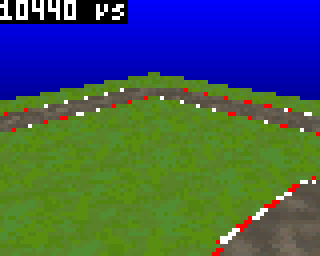

In infinite mode:

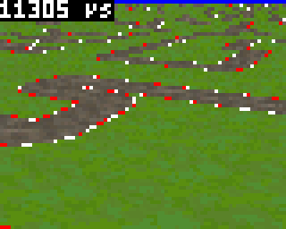

In infinite draw mode we almost doubled the draw duration from about 6.2 ms to 11.3 ms. The performance loss is high but the function remains very usable. Given the advantages of a tile map, it is definitely worth doing that way.

## Part 8: Kart mini-game

Well, finally we have something that looks like a game!

To make it more fun, we will add a kart on the screen and control it with the Gamebuino buttons and pad. This no complete game. It just put the basics in place to check the performance.

We use this marvelous 32x28 picture based on a screenshot of a [Lego kart 3D model](https://sketchfab.com/3d-models/lego-system-3056-go-kart-f249ae60d5b341ed922289ec312d9371) from behind, and then edited pixel-by-pixel with paint.net (and here zoomed 4 times):

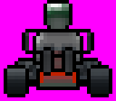

As usual, use an online picture-to-code conversion tool, with the classical transparent color `0xf81f`, and put the code at the top of the sketch file, name the image  `KartLego` (code shortened here):

```C++
const uint16_t KartLegoData[] = {
	32,     // frame width
	28,     // frame height
	1,      // number of frames
	0,      // animation speed
	0xf81f, // transparent color
	0,      // RGB565 color mode
	// frame 1/1
	0xf81f, 0xf81f, 0xf81f, 0xf81f, 0xf81f, 0xf81f, 0xf81f .....
};

Image KartLego = Image(KartLegoData);
```

Now add the static display of this picture just after the draw of the tile map:

```C++
  gb.display.drawImage(24, 30, KartLego);
```

Note that this picture is only displayed for decoration. It does not move and is not animated. Its position is such that it is centered horizontally, and vertically the position is rather subjective (but it could be calculated to match the perspective of the kart).

Now for the control, before the `loop()` function, add the definition of the kart speed, direction and position:

```C++
// Kart variables anf initial values
float kartSpeed=0, kartDirection=PI/2, kartX=24, kartY=136;
```

Here the initial values are integrated to the definition for simplicity (in a real game, depending on the game state, they need to be changed or reset).

The position of the kart `(kartX, kartY)` is directly in the coordinates system of the 256x256 source picture or tile map.

The `kartDirection` is simply a radian angle similar to `a`.

The `kartSpeed` is expressed in pixels per frame. It is the quantity added to the kart position at each frame.

In the `loop()` function, before the `sina`, `cosa`, etc computation, add the following code to compute the position and view direction of the observer from the kart values:

```C++
  // Sets observer position and viewpoint from kart parameters
  a = kartDirection;
  Ox = kartX - 10*cos(kartDirection);
  Oy = kartY + 10*sin(kartDirection);
  h = 5;
```

The view direction of the observer `a` receives directly the `kartDirection`. The distance `h` between observer and source picture is set to 5 to place the view nearer the road (it is a kart not an airplane).

Regarding the position `(Ox,Oy)`, it is equal to the kart position, plus a small offset in the reverse direction of the kart. Consequently, when the `kartDirection` changes, the center of rotation is just under the wheels of the display kart picture, and not under the observer. This is necessary to give the impression that the kart is turning and not flying laterally.

Here again, the value of `10` was found empirically. In a full-featured 3D game, the camera would follow the kart object and this adjustment would be implicit.

Finally, we add the controls. The direction is directly controlled by the buttons LEFT and RIGHT. Add the code at the end of the `loop()` function:

```C++
  // Manages direction
  if (gb.buttons.repeat(BUTTON_LEFT,0))
    kartDirection += 0.06;
  if (gb.buttons.repeat(BUTTON_RIGHT,0))
    kartDirection -= 0.06;
```

For the speed, deceleration or reverse gear will be controlled by the button DOWN. Acceleration will be controlled by the buttons UP and as well A to ease control. Pressing both UP and A at the same time is possible for high speed.

```C++
  // Manages speed
  if (gb.buttons.repeat(BUTTON_A,0))
    kartSpeed += 0.12;
  if (gb.buttons.repeat(BUTTON_UP,0))
    kartSpeed += 0.15;
  if (gb.buttons.repeat(BUTTON_DOWN,0))
    kartSpeed -= 0.05;
```

Physically, the speed cannot increase for ever. There is always friction with the surrounding air such that the kart would decelerate and finally stop if no acceleration is applied. We simulate this friction by taking 90% of the speed after the acceleration. Add the following code just after the A/UP/DOWN control code:

```C++
  // Simulates air drag
  kartSpeed *= 0.9;
```

As a side note, this drag parameter, combined with the acceleration given by pressing A (or UP or both), have a direct influence on the maximum speed of the kart. The computation reaches a steady-state when the multiplication by 0.9 counterbalances the addition of 0.12.

Finally, the kart position is updated by adding to the current position the vector of length `kartSpeed`, with an angle of `kartDirection`:

```C++
  // Updates position
  kartX +=  kartSpeed*cos(kartDirection);
  kartY += -kartSpeed*sin(kartDirection);
```

Note that all these values 0.12, 0.9, etc are largely determined empirically. It gives a good or bad feeling when playing. So it is necessary to spend time on the choice of such values, but it would be difficult to explain or compute them.

Now everything is written. The mini-game is very nice to play, enjoy!!

Here with infinite picture draw:

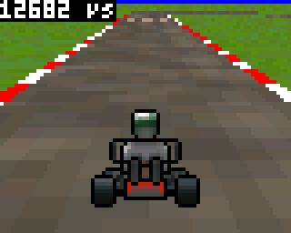

With picture boundaries check, it is cool to go off-road on the edge of the play area (but no, there is no free fall implemented, the kart would start to fly in the blue if going outside):

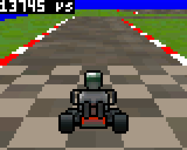

## Part 9: Conclusion

Well, this tutorial is very long!! I hope you understand now better how to use bits and bytes and boolean algebra to write such optimized draw functions.

The obvious next step now is to continue the kart mini-game by adding a full-rotation of the player, several opponents, collisions, jumps, banana peels, different race tracks, etc.. This is only the beginning..

That's all folks!
