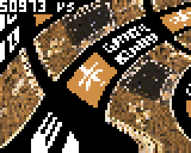

# Affine3D

This tutorial follows the first [Affine tutorial](https://gamebuino.com/community/topic/affine-full-screen-picture-zoom-and-rotation), where we saw how to display a full-screen picture with zoom and rotation.

Here we will see how to re-use the same concepts to display a picture with a 3D effect, then do the same with a tile-map and finally design a mini kart game.

## Introduction

The [Mode 7](https://en.wikipedia.org/wiki/Mode_7) is famous in the world of gaming. With this feature, Nintendo introduced a hardware-based image transformation engine able to support a wide range of 3D effects [used in various games](https://www.youtube.com/watch?v=Z_3clFDpXrg). The idea here is to re-implement something similar on the Gamebuino.

The first Affine tutorial was limited to true [affine transformations](https://en.wikipedia.org/wiki/Affine_transformation) allowing zoom, rotation and shear.

The trick in this tutorial is to **display an image through an affine transformation but change the transformation parameters for each row of pixels**.

Let's start.

## Part 1: Setup

Like in the first tutorial we will start with an image of 256x256 pixels:


So create a new sketch and use the [image transcoder](https://gamebuino.com/creations/image-transcoder) to transform it into code in mode RGB565, calling it "`Picture`". At the beginning of the .ino file, you should now have something like this (shortened here):

```C++
#include <Gamebuino-Meta.h>

const uint16_t PictureData[] = {256,256,1, 1, 0, 0, 0x0,0x0,0x0,0x0,0x0,0x0,0x0,0x0,0x0,0x0,0x0,0x0,0x0,0x0,0x0,0x0,0x0,0x0,0x0,0x0,0x0,0x0,0x0,0x0,0x0,0x0,0x0,0x0,0x0,0x0,0x0,0x0,0x0,0x0,0x0,0x0,0x0,0x0,0x0, .....
```

After that, we add some basic code like in the Affine tutorial to:

- Init everything with `gb.begin()` and framerate setting in the `setup()` function
- Wait for screen update, measure the duration of the draw code and display this duration in microseconds on the screen, in the `loop()` function. Note that printing the string `\xB5` displays actually the greek Mu letter.

```C++
void setup()
{
  // Starts Gamebuino library and sets target frame rate
  gb.begin();
  gb.setFrameRate(50);
}

// Time measurement variable
unsigned long previousStartTime = micros();

void loop()
{
  // Waits for screen refresh
  while(!gb.update());

  // Gets the time at start of the computation
  unsigned long startTime = micros();

  // ...

  // Computes and displays duration
  unsigned long duration = micros()-startTime;
  gb.display.clearTextVars();
  gb.display.setColor(WHITE, BLACK);
  gb.display.print(duration); gb.display.print(" \xB5s");
}
```

## Part 2: Fixed-point arithmetic macros

In order to improve the readability of the code, we will use macros to perform [fixed-point arithmetic](https://en.wikipedia.org/wiki/Fixed-point_arithmetic). Refer to the [Affine tutorial](https://gamebuino.com/community/topic/affine-full-screen-picture-zoom-and-rotation) for fixed-point arithmetic basics.

This code goes at the top of the sketch file.

First of all, we define a new data type for our base fixed-point type, i.e. we will use `FP32` as type for the variable carying a fixed-point value. Unlike in the Affine tutorial, this basic type is not a `union`:

```C++
// Definition of 32-bits fixed-point type for better readability
typedef int32_t FP32;
```

Then we define a macro for conversion from a float to a fixed-point value (instead of writing the same syntax again and again). We use 32-bits fixed-point values, with 16 bits before the dot and 16 bits after the dot. The transformation if done by multiplying the float value by the 2^16=65536 in order to shift the bits to the left, and then to convert the result to an integer to keep only the integer value:

```C++
// FP32 macro to convert from float to FP32
#define FP32_FROM_FLOAT(a) ( (FP32) (65536.0*(a)) )
```

ATTENTION: A macro is not a function. A macro is treated before compilation by the [C preprocessor](https://en.wikipedia.org/wiki/C_preprocessor) and can be seen as a smart text search/replace feature. As an example, here, each time the character string `FP32_FROM_FLOAT(something)` is found in the code, then it gets _replaced_ by `( (FP32) (65536.0*(something)) )`. There is no type or syntax check. It is advisable to use lots of parenthesis in a macro definition to be sure that the replaced string is not interpreted together with surrounding text, leading to strange compilation or run-time errors.

The main advantage of using macros instead of functions is that, after pre-processing, a complex expression remains largely self-contained and does not depend on function calls. Usually, the compiler can better optimize the code if all computation steps are in the same complex expression.

Like in the Affine tutorial, we will need to access different parts of the 32-bits fixed-point values. So we re-use the `union` to access these parts:

```C++
// Defines a union type giving access to the data as 8, 16 or 32 bits integers
union FixedPoint
{
  int32_t  asInt32;
  int16_t  asInt16[2];
  uint16_t asUInt16[2];
  int8_t   asInt8[4];
  uint8_t  asUInt8[4];
};
```

As a side note, it would be possible to access the different parts using bit-shifts and AND/OR operations, but measurements show a better performance by using such a `union` type.

Actually we will not need all members of the `union`. We only need to access the integer part of the fixed-point value, i.e. the 16 most significant bits, and we need to access them in the form of bytes.

So first we define a macro to retrieve the most significant byte of the integer part (taking endianness into account and the strange cast to a `union`):

```C++
// FP32 macro to extract most significant signed byte of the integer part of an FP32 value
//#define FP32_MSBYTE(A) ( (int8_t) ( ((int8_t*)&(A))[3]) )
#define FP32_MSBYTE(A) ( (int8_t) ( (FixedPoint({(A)})).asInt8[3] ) )
```

Second we define a macro to retrieve the least significant byte of the integer part as unsigned byte:

```C++
// FP32 macro to extract least significant unsigned byte of the integer part of an FP32 value
//#define FP32_LSBYTE(A) ( (uint8_t) ( (uint8_t*)&(A))[2] )
#define FP32_LSBYTE(A) ( (uint8_t) ( (FixedPoint({(A)})).asUInt8[2] ) )
```

At this stage a small example is certainly useful. So let's take the value `a=500.5`:

- `a*65536 = A = 32800768`, so `FP32_FROM_FLOAT(500.5)` gives the value `A=32800768` or `0x01F48000` in hexadecimal.
- The hexadecimal view shows clearly the integer part of this value equal to `0x01F4` or `500` in decimal.
- In turn, the most significant byte of the integer part is `0x01` so `FP32_MSBYTE(A)` return `0x01` or `1` in decimal.
- And the least significant byte of the integer part is `0xF4` so `FP32_LSBYTE(A)` return `0xF4` or `244` in decimal (unsigned).

I can imagine that this part is hard to follow. It is not necessary to understand completely the bits and bytes here to understand the rest of the tutorial. Just use the macros definition as provided.

## Implementation of the draw procedure

Now that we have a comprehensive set of macros and type definitions, we can re-write the function that draws one row of pixels with an affine transformation.

The goal of this draw procedure is to fill a row of pixels on the screen from left to right, and the color of each pixel is read from a straight line on the source picture starting at a given position `(x,y)`, where `x` and `y` are fixed-point values.

Technically:

- For each pixel to draw on the screen row, the color is read from the source picture at a position equal the the integer parts of `x` and `y`
- Once the pixel is written on the screen, we go to the next pixel to draw, and the values of `x` and `y` are incremented by the fixed-point values `dx` and `dy`, i.e. `x=x+dx` and `y=y+dy`

That's all! It is really just like: take the color at `(x,y)` on the source picture, write the pixel on the screen, then go to the next position on the source picture by adding `(dx,dy)` to `(x,y)`, write the next pixel and so on.

Because the "column increment" `(dx,dy)` is constant, the successive values of `(x,y)` follow a straight line on the source picture.

We will access the screen and the source picture directly in memory. Following the good remarks of [Alban](https://gamebuino.com/@Alban) on the Affine tutorial, we just define the two pointers `Color* source` and `Color* destination` as parameters to the function.

`destination` will point to the current pixel being drawn in the buffer of `gb.display`.

`source` will point to the first pixel of the source picture, and will be used as one-dimensional array.

The main trick of this draw procedure is the choice of the size of the source picture: 256x256. It means that each X and Y coordinate of a pixel fits exactly on one unsigned byte (with a value from 0 to 255), hence:

- If the `x` or `y` coordinate is represented as an `FP32` variable (with a 16-bits integer part), then:
  - If the most significant byte of the integer part is equal to zero, then the coordinate is inside the picture (between _0_ and _255_), e.g. `0x0123=291` is outside (most significant byte is `0x01=FP32_MSBYTE(0x0123)`), `0x00FF=255` is inside (MSB is `0x00`), `0xFFFE=-2` is outside (MSB is `0xFF`). This is why we defined the macro `FP32_MSBYTE`
  - If the `x` and `y` coordinates as `FP32` are between _0.0_ and _255.9999_, we need just to extract the least significant byte of the integer part, e.g. from `(int32_t)(255.9999*65536)=16777215=0x00FFFFFF` the integer part (16 most significant bits) is `0x00FF` and its least significant byte is `0xFF=255=FP32_LSBYTE(16777215)`. This is why we defined the macro `FP32_LSBYTE`
- If we extract the byte values `X=FP32_LSBYTE(x)` and `Y=FP32_LSBYTE(y)`, the offset of the pixel in the source picture is given by `Y*256 + X` or `Y<<8 + X` (because an 8-bits shift is the same as multiplying by 2^8=256).

Tricks with integers and boolean algebra are almost magical! By using powers of 2, mulplications, modulos and divisions become just bit shifting and masking. Such tricks would deserve a specific tutorial.

Time to write the draw procedure. We want to draw exactly 80 pixels on each pixel row. Instead of a loop, we will define again a macro that will repeat the same code 80 times. The definition is straightforward:

```C++
// Macros to repeat 80 times the same text
#define REPEAT20(X) X X X X X X X X X X X X X X X X X X X X
#define REPEAT80(X) REPEAT20(X) REPEAT20(X) REPEAT20(X) REPEAT20(X)
```

Once again, here are the parameters summarized:

- `x` and `y` are FP32 variables pointing to the location in the source picture to take pixels from
- `dx` and `dy` are FP32 variables representing the "column increment"
- `source` is a `Color` array containing the source picture
- `destination` is a `Color*` pointer on the pixel to draw in the screen frame buffer
- `background` is a background color to use in case one of the `x` or `y` coordinate is outside the source picture

Then the main part of the procedure is easily understandable. We repeat 80 times:

- If one of the `x` or `y` coordinates is not pointing inside the picture, then the current pixel at `destination` on the screen receives the `background` color, then `destination` is incremented to move to the next pixel on its right
- Otherwise the current pixel at `destination` receives the color picked from the `source` picture at offset `Y*256+X`, where `X` and `Y` are the least significant bytes of the integer parts of `x` and `y`, then `destination` is incremented
- Finally `x` is incremented by `dx` and `y` by `dy`

As C++ code:

```C++
    REPEAT80(
      if (FP32_MSBYTE(x)!=0 || FP32_MSBYTE(y)!=0)
        *destination++ = background;
      else
        *destination++ = source[ FP32_LSBYTE(x) + (FP32_LSBYTE(y)<<8) ];
      x += dx; y += dy;
    )
```

Like in the Affine tutorial, the boundaries test on the `x` and `y` coordinates can be just ignored. It is safe to use the least significant bytes because their values are automatically between 0 and 255 and hence always correspond to a point in the source picture. The resulting effect is that the picture is displayed as if it would be repeated infinitely in all directions.

We can the define a new boolean `infinite` and write the final version of the draw function (which goes at the beginning of the sketch, after the macros definition):

```C++
// Draws one row of 80 pixels at destination using pixel colors from the source picture
// at (x,y) and incremented at each pixel by (dx, dy)
Color* drawRow(Color* source, Color* destination, FP32 x, FP32 y, FP32 dx, FP32 dy,
               bool infinite=true, Color background=BLACK)
{
  // Repeat 80 times the same instructions without boundaries test if infinite
  if (infinite)
  {
    REPEAT80(
      *destination++ = source[ FP32_LSBYTE(x) + (FP32_LSBYTE(y)<<8) ];
      x += dx; y += dy;
    )
  }

  // Repeat 80 times the same instructions with boundaries test
  else
  {
    REPEAT80(
      if (FP32_MSBYTE(x)!=0 || FP32_MSBYTE(y)!=0)
        *destination++ = background;
      else
        *destination++ = source[ FP32_LSBYTE(x) + (FP32_LSBYTE(y)<<8) ];
      x += dx; y += dy;
    )
  }

  // Returns the last value of destination, now pointing on the first pixel of the next row
  return destination;
}
```

Last remark: the function returns the last computed `destination` value. It is useful because after drawing one line of pixels, it points to the first pixel on the next line.

## Part 3: Non-affine deformation

Enough theory, after this long reminder of the Affine tutorial, and now that the draw procedure is written, let's see how to play with it!

Before the loop, define a global `infinite` variable to control boundaries check (modify this variable manually as you wish):

```C++
  // Considers boundaries of source picture or wrapped infinitely
  bool infinite=false;
```

At the beginning of the `loop()`, add the following code to initialize the first values of our pointers, and define start values for the positions and increments:

```C++
  // Inits pointers on source and destination pixel arrays
  Color* source = (Color*)(PictureData+6);
  Color* destination = (Color*)(gb.display._buffer);

  // Defines other variables
  Color background;
  FP32 startx, starty, incx, incy;
```

Then, in `loop()` under the `unsigned long startTime = micros();` line, add a new float counter called `time`, giving the current time in seconds:

```C++
  // Time in seconds
  float time = (float)startTime/1e6;
```

Then add the following loop on the successive rows of the screen, which first defines a shaded `background` color, and then inits the start positions and increments to some mathematical functions depending on the new `time` counter (used mainly as angle of trigonometry functions).

I won't explain the formulas, because they were designed with mathematical feeling more than reasoning, just to get something nice to look at!

```C++
      // Loops on each row
      for(int y=0; y<64; y++)
      {
        // Creates background color for this row, blue shade from light to dark
        background = gb.createColor(0,0,(64-y)*4-1);

        startx = FP32_FROM_FLOAT(-50);
        starty = FP32_FROM_FLOAT((float)y*4.0);
        incx =   FP32_FROM_FLOAT((1.5+cos(time+(float)y/20.0))*2.0);
        incy =   FP32_FROM_FLOAT((1.5+sin(time+(float)y/20.0))*2.0);

        destination = drawRow(source, destination, startx, starty, incx, incy, infinite, background);
      }
```

The result is cool, here with picture boundaries check i.e. `infinite=false`:


With `infinite=true`:



## Part 4: Non-optimized 3D projection

Let's now try to do something more useful with the draw function: simulate a 3D view of the source picture. Again, the principle here is to determine the start position and the increments for each line.

So we consider an observer at **O** looking down to the picture through a **screen** such that the top of the screen is located at the same height as the observer, here seen from the right:


The observer will see the first line of the picture at **A** and the last line at **B**. From A to B, due to the perspective, the distance decreases between successive drawn lines (i.e. objects appear smaller when they are farer). So the _row increment_, as named in the first Affine tutorial, is not constant during the draw.

Please note that, at the very top of the screen, the observer looks to the infinite and its line of sight will not cross the source picture. Furthermore, the first lines at the top of the screen will show the picture at such a distance that it is no use  drawing them. A kind of "moire" effect can be expected here. A consequence of these remarks is that we will skip the top lines during the draw.

We define the following parameters (all positive):

- _s_ : Distance between the observer and the screen
- _h_ : Height of the observer, i.e. distance between the observer and the plane containing the source picture
- _y_ : Coordinate on the screen of the row of pixels being drawn
- _d_ : Distance between observer and point in the source picture being drawn (projected in the plane containing the source picture)

We can derive a first equation from this view. It is noticeable that the line from observer to top of screen and the plane containing the source picture are parallel, and the line OA crosses them. As a result, the triangles formed by a segment of the line OA, one of the parallel horizontal lines and one vertical lines are right triangles and are all similar. The ratios of the length of their edges are equal, in particular:

    s/y = d/h

Seen from the top, the rotating observer at **O** sees the picture through the screen at **C** on the source picture when looking at the middle of the screen, and at **D** when looking at the left edge of the screen:


We define the following additional parameters (all positive):

- _w_ : Half-width of the screen
- _c_ : Half-length of a straight-line read from the source picture
- _a_ : Angle of the view direction of the observer in the plane containing the source picture

Here again we can notice similar triangles in OCD and equal ratios, in particular:

    w/s = c/d

This equation shows very clearly the proportional relationship between pixel coordinates on a row and the positions on the line DC. In other words, it shows that the "column increment" is constant during the draw and that we can use a row draw function with constant column increment.

Now, the next step is to determine the position in the source picture of the start point of each row to draw, and the corresponding column increment. The start point is D on the picture, and the column increment can be deduced from DC.

Classically, we use trigonometry to calculate the coordinates of D by projecting the components on each axis. If O has the coordinates _(Ox,Oy)_ and D has _(Dx,Dy)_, using the parameters as previously defined and the (inverted) coordinate system shown on the diagram, we go from O to D through the vectors OC and CD:

    Dx = Ox + d*cos(a) - c*sin(a)
    Dy = Oy - d*sin(a) - c*cos(a)

The column increment with coordinates _(Ix,Iy)_ can be calculated as the vector DC divided by _w_, number of pixels to draw:

    Ix = c*sin(a)/w
    Iy = c*cos(a)/w

We have now the basic formulas but _c_ and _d_ are still unknown, so we need to re-use the equations found previously.

    d = s*h/y
    c = d*w/s = (s*h/y)*w/s = w*h/y

And finally:

    Dx = Ox + s*h*cos(a)/y - w*h*sin(a)/y
    Dy = Oy - s*h*sin(a)/y - w*h*cos(a)/y
    Ix = h*sin(a)/y
    Iy = h*cos(a)/y

The hard part was to determine the formulas. In comparison the implementation is easy. First add the definition of the 3D view parameters somewhere before the `loop()` function:

```C++
// 3D view parameters
float s, h, w, Ox, Oy, a;
int firstRow = 1;
```

Here `firstRow` gives the `y` coordinate of the first row where the 3D draw begins. As we saw previously, the formulas will fail if `y` is zero (due to the division by `y`). It will remain constant.

Somewhere in the `loop()` function, assign values to the parameters. `a` is directly equal to `time` and the `h` parameter follows a sine curve with the time. Other parameters are fixed. Change the parameter values to see what happens:

```C++
  // Default view values
  s = 100;
  w = 40;
  a = time;
  Ox = 128;
  Oy = 128;
  h = 25+10*sin(time/3);
```

Finally, replace the loop by the following code, which implements the formulas directly:

```C++
      // Loops on each row
      for(int y=0; y<64; y++)
      {
        // Creates background color for this row, blue shade from light to dark
        background = gb.createColor(0,0,(64-y)*4-1);

        // First lines are filled with background to avoid division by zero and moire effect
        if(y<firstRow)
          for(int px=0; px<80; px++)
            *destination++ = background;
        else
        {
          // Computes start point and increment as floats
          float Dx = Ox + s*h*cos(a)/y - w*h*sin(a)/(float)y;
          float Dy = Oy - s*h*sin(a)/y - w*h*cos(a)/(float)y;
          float Ix = h*sin(a)/(float)y;
          float Iy = h*cos(a)/(float)y;

          // Transforms floats into fixed-point variables
          startx = FP32_FROM_FLOAT(Dx);
          starty = FP32_FROM_FLOAT(Dy);
          incx =   FP32_FROM_FLOAT(Ix);
          incy =   FP32_FROM_FLOAT(Iy);

          // Draws row
          destination = drawRow(source, destination, startx, starty, incx, incy, infinite, background);
        }
      }
```


## Part 4: Optimization with fixed-point computation

As a reminder, to encode a floating-point value into a fixed-point integer value we shift the bits to the left, or multiply by a power of 2, such that the fractional part moves to the integer part. Then we convert to an integer, removing the fractional part. For example,  if `aFP` is the encoded value of `a`, with 16 bits precision after the dot:

```C++
aFP.asInt32 = (int32_t)(65536.0*a);
```

In this section we will use capital letters for fixed-point encoded values, and small letters for their float equivalents. We will also consider that the remaining fractional part, cut while converting to an integer, is neglectible. As a result, we do not need to take the integer conversion into account.

So if we name `F` the factor power of 2 used for conversion (here equal to 65536), we can define the 3 variables encoded as fixed-point values:

    A = a*F
    B = b*F
    C = c*F

Let's look at the **Multiplication of fixed-point values**. We search `C`, encoded value of `c`, such that:

    c = a * b

After replacements:

    c = C/F = A/F * B/F

Or:

    C = A * B / F

It means that after multiplying the 2 integer values, we need to shift the result to re-align it to the dot. This implies that the result of `A * B` is encoded on 64 bits.

There is a trick to perform just a 32-bits multiplication, even if we lose some precision: before the multiplication, we can pre-shift `A` and `B`. I used that in Fractalino. Let's define `G` as the factor representing a half-shift (here it is equal to 256), i.e. such that:

    F = G*G

Replacing it in the multiplication formula:

    C = (A/G) * (B/G)

Mathematically it makes no difference, but allows to first shift our values to 16-bits integers, losing the most-significant bits that would anyway overflow, and then multiply and get directly the 32-bits value.

Now let's look at the **division of fixed-point values**. We search `C`, encoded value of `c`, such that:

    c = a / b

After replacements:

    c = C/F = A/B

Or:

    C = (A * F) / B

It means that before dividing, we need to pre-shift `A` on 64 bits.


