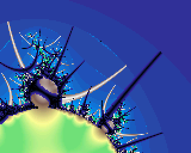

# Fractalino: Fractal viewer for the Gamebuino

This application displays fractal sets defined as an iterative function in the complex plane, including the [Mandelbrot set](https://en.wikipedia.org/wiki/Mandelbrot_set). Fractals are rendered with gradient coloring and [orbit-traps](https://en.wikipedia.org/wiki/Orbit_trap).

Internal computation is performed either with 32-bits fixed point numbers (for maximum performance) or with 64 bits fixed point numbers, with an automatic switch of precision depending on the zoom level.

The interactive viewer allows to pan and zoom in the plane using the joypad and the buttons. It uses the gb.tft directly for high resolution pictures. It is designed primarily for the Gamebuino but could be ported to other Arduino hardware with color display.

How to control Fractalino on the Gamebuino:

- <kbd>Joypad</kbd> : Pan the observer view
- <kbd>A</kbd> / <kbd>B</kbd> : Zoom
- <kbd>Menu</kbd>+<kbd>A</kbd> : Change gradient shade 1
- <kbd>Menu</kbd>+<kbd>B</kbd> : Change fractal type
- <kbd>Menu</kbd>+<kbd>Left</kbd>: Change gradient shade 2
- <kbd>Menu</kbd>+<kbd>Right</kbd>: Change inside rendering type
- <kbd>Menu</kbd>+<kbd>Down</kbd>: Change outside rendering type
- <kbd>Menu</kbd>+<kbd>Up</kbd>: Change maximum number of iterations and peaks thickness

