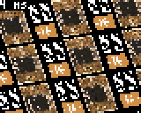

# Arduino/Gamebuino tutorials, sketches and libraries

This repository contains my contributions to the [Arduino](https://www.arduino.cc/) and [Gamebuino](https://gamebuino.com/) communities.

## Affine: Full-screen picture zoom and rotation

This tutorial shows how to display a 256x256 picture through an optimized "affine transformation".

## Affine3D: Full-screen 3D display of a tilemap

This tutorial continues the Affine tutorial to display a picture or tilemap in 3D.

## ArduinoStructure: Understanding Arduino files and folders

Description of the internal structure of the Arduino build system and IDE, including sketchbook, hardware packages, tools etc.

## VSCode: Visual Studio Code for Gamebuino and Arduino with IntelliSense

Complete configuration of the Arduino extension of Visual Studio Code, and optimized use of IntelliSense.

## Fractalino: Fractal viewer for the Gamebuino

Application to explore fractal sets such as Mandelbrot and Julia with orbit trapping rendering.
