# Visual Studio Code for Gamebuino with IntelliSense

## Introduction

The Arduino IDE is a good starting point to code with the Gamebuino, but it lacks features that one can expect from a modern development environment:

- Context-aware syntax highlighting (the highlighting in the Arduino IDE is based on static keywords)
- Code auto-completion
- Contextual information on function or structure definition

[VSCode](https://code.visualstudio.com/docs/introvideos/basics) is an open source IDE from Microsoft (more or less based on Visual Studio) that provides all these modern features under the name [Intellisense](https://code.visualstudio.com/docs/editor/intellisense) and supports Arduino development. So it is normal to try to use it with the Gamebuino.

There is already a [tutorial in french](https://gamebuino.com/index.php/creations/install-arduino-on-vscode) by [delay](https://gamebuino.com/index.php/@delay) for the basic steps, and a [forum post](https://gamebuino.com/fr/community/topic/solution-corriger-les-erreurs-intellisense-dans-visual-code-avec-le-plugin-arduino-windows?page=1) by [Crystal Noir](https://gamebuino.com/@1316) regarding the proper configuration of "IntelliSense" (the VSCode set of functions for context-aware features). This is a good basis, but I could not really make IntelliSense work as expected, with unpredictable results. Eventually, by chance, it worked.

So I found the problem deserves more in-depth analysis, and a decent understanding of the "obscure reasons". So here we are! Consider this tutorial as the English version of the other one, with some formalization of the IntelliSense configuration.

Here is a list of the software versions used for this tutorial. If anything changes in some future version, you may need to adapt parts of this tutorial or downgrade your installation to match exactly the setup below:

- Windows 10
- Arduino IDE 1.8.8
- VSCode 1.32.3
- C/C++ extension `ms-vscode.cpptools` 0.22.0
- Arduino extension `vsciot-vscode.vscode-arduino` 0.2.25
- Arduino SAMD Board (32-bits ARM Cortex-M0+) version 1.6.20
- Gamebuino META Board version 1.2.1
- Gamebuino Library version 1.3.1

Please feel free to **give me some hints how it works under MacOS**, such that I can integrate the info in the tutorial.

## Setup VSCode for sketch compilation and upload

The next sections below are similar to the [existing tutorial in french](https://gamebuino.com/index.php/creations/install-arduino-on-vscode). You can follow the other tutorial if you prefer and then go to the "Enhanced sketch setup" directly.

### Location of the Arduino IDE

Before even thinking of using VSCode, we need a working Arduino IDE. We need it for the compiler/linker tools, not for the editor. So make sure that the Arduino IDE is properly installed (if you can upload a sketch to the Gamebuino then it should be OK).

Now you need to **determine the installation folder of the Arduino IDE**. This folder is usually `C:\Program Files (x86)\Arduino` for a standard Windows installation or `/Applications/Arduino.app` under MacOS. It is a user-created folder in case of portable installation (like the Gamebuino pre-cooked IDE) or installation in a user-defined folder. This is the folder where you can find the `arduino-builder` (named `arduino-builder.exe` if your OS is Windows). Please refer to [my other tutorial on the Arduino IDE](https://gamebuino.com/index.php/creations/understanding-the-arduino-ide) for more details.

### Setup of Arduino extension in VSCode

Now open VSCode, click on the extension icon, then enter _arduino_ in the search field. Normally, the wished extension will appear in the first hits:

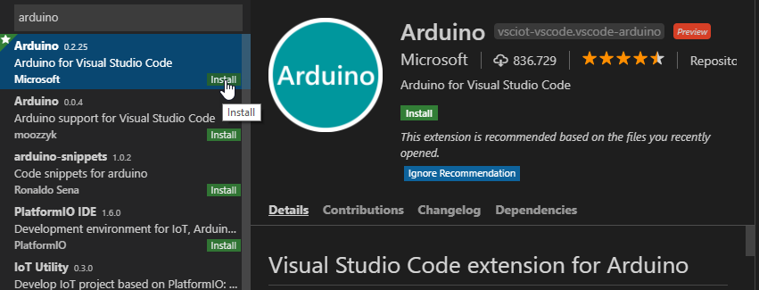

We use the extension created by Microsoft called `vsciot-vscode.vscode-arduino`. Click on _Install_.

Please note that installing this extension triggers the installation of another extension (if not yet installed), the more general C/C++ language support extension called `ms-vscode.cpptools`. The Arduino extension relies on it:

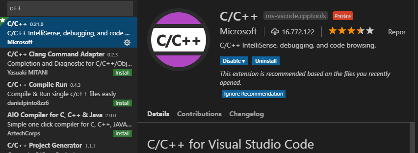

As described on the help page of the Arduino extension, several settings can be changed, but it is at least **required to enter the path to the Arduino IDE** (see beginning of this section). In the user settings (menu _File > Preferences > Settings_), search for "arduino", look for the entry _Arduino: Path_ and enter the path to the Arduino IDE, then re-start VSCode.

I recommend as well to set the `logLevel` to `verbose`. It shows the compiler and linker commands during compilation of a sketch, what may help to understand if some included files are missing in our VSCode IntelliSense settings later on.

Now open the "Command palette" with <kbd>Ctrl</kbd> <kbd>Shift</kbd> <kbd>P</kbd> and enter "arduino", then click on _Arduino: Board Manager_. If everything was setup correctly, a list of the available/installed boards should appear (here on the right part of the window), very similar to the Board Manager in the Arduino IDE:

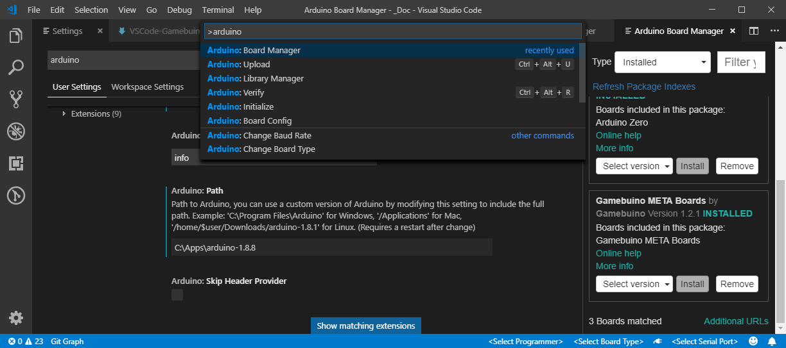

On this screenshot you can see as well the Arduino extension settings, where I entered the path to my Arduino IDE installation at `C:\Apps\arduino-1.8.8`.

Now the basic setup is done, time to compile a sketch.

### Basic sketch setup

In VSCode, many things work better if you _open a folder_ instead of opening a single file. It is anyway better because other files of the folder appear nicely in the Explorer pane and can be opened quickly.

So **open the containing folder of a sketch of your choice** with _File > Open folder.._. Then select the .ino file in the Explorer. You should see something like this:

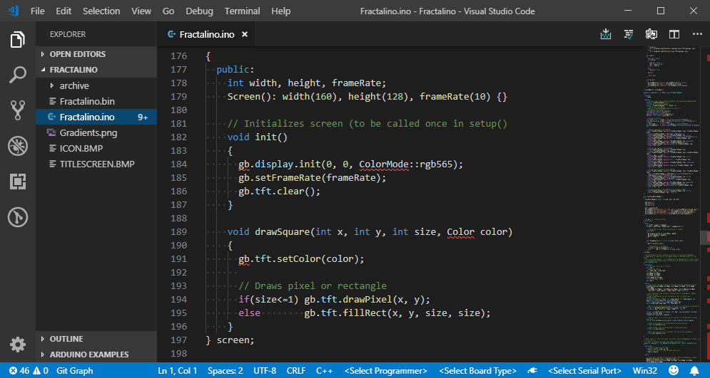

As you can see I use Fractalino as sketch for this tutorial. Note that:

- Syntax highlighting is already working very well!
- Standard objects and functions are not recognized at all, e.g. `gb` is underlined in red and the .ino file is marked with "9+" errors
- The board type and port are not configured (see bottom-right of the screenshot)

Time to **setup the connection to the Gamebuino** for this sketch, like in the Arduino IDE. Make sure that the Gamebuino is connected and switched on, then click on the `<Select Board Type>` and `<Select Serial Port>` and select the correct values.

ATTENTION: by connecting the Gamebuino while the sketh is openend but not yet configured, the Arduino extension may auto-detect the wrong board type e.g. `Arduino/Genuino Zero`. In such a case click on the board type name and select the `Gamebuino Meta` board type instead.

Alternatively, you can use again the command palette <kbd>Ctrl</kbd> <kbd>Shift</kbd> <kbd>P</kbd>:

- `Arduino: Board Config` and select the Gamebuino board
- `Arduino: Select Serial Port` to select the port
- `Arduino: Initialize` to do the same completely in the command palette

Note that I never selected a Programmer and it is working fine.

At this point, it should be possible to compile and upload the sketch by typing <kbd>Ctrl</kbd> <kbd>Alt</kbd> <kbd>U</kbd> or starting `Arduino: Upload` in the command palette. To just verify your sketch type <kbd>Ctrl</kbd> <kbd>Alt</kbd> <kbd>R</kbd> or `Arduino: Verify`.

### Enhanced sketch setup with output folder

You may have noticed that **by selecting the board type, a new folder `.vscode` is created** in your project:

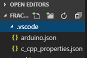

The new folder contains two files:

- `.vscode\arduino.json`: general information about your sketch, the build, etc. The parameters are described on the [presentation page of the Arduino extension](https://marketplace.visualstudio.com/items?itemName=vsciot-vscode.vscode-arduino).
- `.vscode\c_cpp_properties.json`: configuration of the C/C++ VSCode extension. This is the file we will have to tweak. There is an [extensive documentation of the C/C++ extension on GitHub](https://github.com/Microsoft/vscode-cpptools/tree/master/Documentation).

In this section we will only look at `arduino.json`. See below for the IntelliSense setup.

It is important to **define an output folder in `arduino.json` to create a .bin from your sketch**. I could not find any command like _Arduino: Export Executable_ or similar. It seems to be the only way to create a .bin with VSCode.

To define the output folder, simply open the `arduino.json` file and add the line `"output": "build"` somewhere. Use a name different from `build` if you wish. **Make sure that commas are written properly** when modifying the file manually (JSON is kind of annoying for that), i.e. the last line of a JSON block without comma, the other ones with (like a C array).

After modification, the files should look like this (port and sketch will differ):

```json
{
    "sketch": "Fractalino.ino",
    "board": "gamebuino:samd:gamebuino_meta_native",
    "port": "COM14",
    "output": "build"
}
```

Starting a _Verify_ or _Upload_ will trigger the creation of the output folder, which will be filled by the different files created during compilation. At the end of the compilation, you will find in this folder the .bin file, named in my example `Fractalino.ino.bin`.

In addition, by defining an output folder, the compilation does not start from the beginning each time because compiled files are conserved in the output folder structure, reducing the time for compilation. My experience is that it only works with a portable installation of the Arduino IDE. With a non-portable installation, under Windows, I always see the compilation starting from the beginning every time, even if no file changed (in the Arduino IDE or in VSCode). It seems to be an anti-virus issue.

It is interesting to explore the `build` folder once generated because it delivers precious information about the Arduino IDE and sketch setup. This can be useful to set up IntelliSense. The [arduino-builder tool](https://github.com/arduino/arduino-builder) creates many files, including:

- `build.properties.json`: set of build parameters, stored for comparison between builds
- `includes.cache`: text file with a JSON table of paths used as includes
- `sketch\Fractalino.ino.cpp`: C++ file generated from the .ino file, starting with a line `#include <Arduino.h>` added during the build process

At this point, note that you can keep pre-processed and assembler files generated during the compilation. Such files are as well interesting in order to understand what is going on in the build process. To do so, change extra flags in `platform.txt` as `compiler.cpp.extra_flags=-save-temps=obj` (refer to [my other tutorial on the Arduino IDE](https://gamebuino.com/creations/understanding-the-arduino-ide) for detailed information).

We can consider the configuration of the `arduino.json` completed now. As a concluding remark, we did not use the `prebuild` option in `arduino.json`. This is not necessary for now but may be interesting to integrate a pre-processing step (e.g. transform a `.png` into a `.h` header file containing its data as C array).

At this point, **you may just jump directly to the conclusion**, that gives a full version of the `build.properties.json` file with instructions to adapt it to your needs. The two next main sections discuss all details to configure IntelliSense.

## Basic configuration of IntelliSense with the Tag Parser

### Two IntelliSense engines

This is probably the main source of confusion when using VSCode, [two IntelliSense engines are available in VSCode](https://github.com/Microsoft/vscode-cpptools/blob/master/Documentation/LanguageServer/IntelliSense%20engine.md):

- **Default**: Default engine that provides semantic-aware IntelliSense features
- **Tag Parser**: The "fuzzy" IntelliSense engine that provides quick but "fuzzy" results, not aware of code semantic

The C/C++ IntelliSense is currently in a transition phase where the Tag Parser is still used for some features, and the Default engine is incrementally improving. The Tag Parser is possibly used as _Fallback_ of the Default engine in case includes cannot be resolved.

At this point, please note that the engines are configured with different variables! For instance, the list of paths to search for included files are defined as:

- `includePath` for the Default engine, files are searched _non-recursively_ except if the path ends with `/**`
- `browse.path` for the Tag Parser, files are searched _recursively_ except if the path ends with `/*`

What a good idea to confuse people!!

### Configuration in User Settings

To change the user settings that control the behavior of the C/C++ IntelliSense engine:

- Open _File > Preferences > Settings_, then search for the string _intellisense_
- We will start using the Tag-Parser engine, hence set:
  - _C\_Cpp: IntelliSense Engine_: _Tag Parser_
- Make sure that these parameters are set as following (or use you own values if you know what you are doing!):
  - _C\_Cpp: Autocomplete_: _Default_
  - _C\_Cpp: Error Squiggles_: _Enabled_
  - _C\_Cpp: IntelliSense Engine Fallback_: _Disabled_
  - _Editor_: _Tab Completion_: _on_

ATTENTION: When IntelliSense detects an issue, it displays a light bulb . If you click on _Allow "fuzzy" IntelliSense_ (to activate Tag Parser) or _Force semantic IntelliSense_ (to activate the Default engine), then a **new file `.vscode/settings.json` is created that overrides the global setting _C\_Cpp: IntelliSense Engine Fallback_**. You can just remove the file to keep the global settings.

In addition, please **activate the logging of the C/C++ extension** because it shows the activity of IntelliSense. This is necessary to understand what IntelliSense is trying to do, and what it does wrong sometimes. To [activate logging](https://github.com/Microsoft/vscode-cpptools/blob/master/Documentation/LanguageServer/Enabling%20logging.md):

- Open _File > Preferences > Settings_, then search for the string _loglevel_
- Set the value _C\_Cpp: Logging Level_: _Debug_

Log output is visible in the _Output_ pane, after selecting _C/C++_ in the drop-down list:

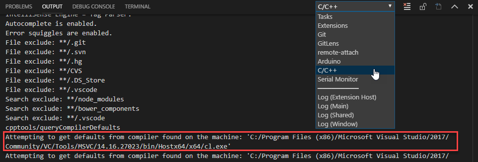

ATTENTION: as shown on the picture, the C/C++ extension **tries to discover other compilers on the machine, which are most probably completely unrelated to the Gamebuino project!!!**. This may lead to pollution of the IntelliSense results. From my experience, I could not see a real effect of parsing such unrelated files until now (probably because `browse.limitSymbolsToIncludedHeaders` is set to `true`, see below).

### Complete reset of the IntelliSense Database

It is possible to reset the IntelliSense engine database by executing `C/C++: Reset IntelliSense Database` in the command palette.

It seems to be a good idea after changing the configuration, but according to the logs, this is no complete reset (at least the compiler will not be searched/queried again).

Under Windows, depending on the version of the C/C++ extension, the IntelliSense database may be located at:

- New folder created in `C:\Users\[UserName]\AppData\Roaming\Code\User\workspaceStorage` for any open project folder or sketch, containing a sub-folder `ms-vscode.cpptools` where the IntelliSense database is stored as `.BROWSE.VC.DB`.
- `.vscode/ipch` folder of the current sketch

It is possible to close the related VSCode project, identify the related folder (not so easy, e.g. by looking at the file modification dates), remove the database file and restart VSCode. After such an action, logs show the complete procedure including compiler detection and so on.

It should be possible to perform the same kind of action under MacOS and Linux (please let me know where the files are stored, such that I can add it in the tutorial).

### General structure of `c_cpp_properties.json`

Parameters of both engines are described in details in the [c_cpp_properties.json reference guide](https://github.com/Microsoft/vscode-cpptools/blob/master/Documentation/LanguageServer/c_cpp_properties.json.md) on GitHub. In addition to the paths, noticeable parameters for Arduino are:

- `name`: Name of the configuration, useful to define one file for different systems (by default `Win32`)
- `intelliSenseMode`: Mode of the engine, as we are using GCC `gcc-x64` seems to be the best choice
- `cStandard` / `cppStandard`: C/C++ language standards to interpret code. It may make no real difference if set incorrectly, but because the arduino-builder uses the option `gnu11` and `gnu++11` (look at the `platform.txt` file of the gamebuino hardware folder or any compilation output), we will use `c11` and `c++11`.
- `forcedInclude`: list of files to include. The file `Arduino.h`, added at the beginning of the main `.ino` file, needs to be set there.
- `defines`: Extra definition of macro values, which should reflect the exact set of `#define` lines to correctly interpret header files
- `browse.limitSymbolsToIncludedHeaders`: Limit tag search to files included directly or indirectly from the sketch. We set it to `true` to avoid long lists of unrelated tags when using auto-completion.

Finally, be aware that it is safe to delete the `c_cpp_properties.json` file. It can be re-created with default values by starting `C/C++: Edit configurations...` in the command palette (the default values will not be useable in most cases).

ATTENTION: the file can be changed without any notice when adding a new library using the "Include library" button of the Library Manager or setting up a board. Absolute paths are added to the file, which may or may not be useful. Added lines in `includePath` or `forcedInclude` can be removed manually.

### Building the c_cpp_properties.json file

To make the file more generic, we will use variable substitution as described in the [VSCode variables reference](https://code.visualstudio.com/docs/editor/variables-reference). We will use:

- `${env:USERPROFILE}`: path to the user's home directory on Windows
- `${workspaceFolder}`: folder opened in VSCode (so it is important to always open the folder of the sketch)

To build the file, a basic understanding of the Arduino IDE structure is necessary. In particular, it is important to know the location of the include folders and know that the file `Arduino.h` is added at the beginning of the main `.ino` file. Please refer to [my other tutorial on the Arduino IDE](https://gamebuino.com/index.php/creations/understanding-the-arduino-ide) for more details.

This is a first implementation of the file for Windows **using the Tag Parser** (not the Default engine so there is no `includePath`), and assuming that the sketchbook is at its default location (`Arduino` folder in user's home folder). **Edit the lines in the `env` block to adapt to your setup** if necessary:

```json
{
    "env": {
        "PACKAGES_PATH": "${env:USERPROFILE}/AppData/Local/Arduino15/packages",
        "SKETCHBOOK_PATH": "${env:USERPROFILE}/Documents/Arduino"
    },
    "configurations": [
        {
            "name": "Win32",
            "intelliSenseMode": "gcc-x64",
            "cStandard": "c11",
            "cppStandard": "c++11",

            "browse": {
                "path": [
                    "${workspaceFolder}",
                    "${env:PACKAGES_PATH}/arduino/tools",
                    "${env:PACKAGES_PATH}/gamebuino/hardware",
                    "${env:SKETCHBOOK_PATH}/libraries"
                ],
                "limitSymbolsToIncludedHeaders": true
            },

            "forcedInclude": [
                "${env:PACKAGES_PATH}/gamebuino/hardware/samd/1.2.1/cores/arduino/Arduino.h"
            ]
        }
    ],
    "version": 4
}
```

Note that the single slash separator (`/`) can be used in JSON files even for Windows paths. Otherwise, each backslash needs to be escaped with an extra backslash (`\\`). Using single slash characters will ease the portability to Linux/MacOS. And as always, keep in mind that JSON is very sensitive to commas if you edit the file.

This implementation is very rough. It allows VSCode to find all include files, but has a number of drawbacks, including:

- Because we are using the Tag Parser, auto-completion still shows many unrelated functions or members to choose from, e.g. some USB-related definition for `gb.tft`:
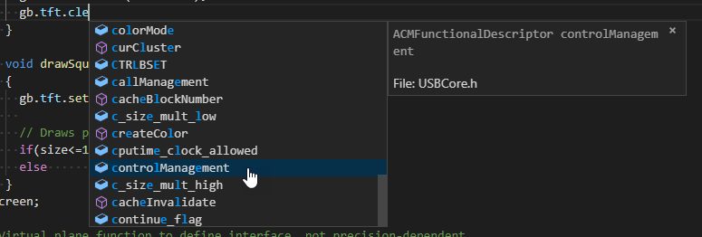

- Similarly, the tool-tips show too many function definition hints when hovering with the mouse. The user is expected to know the correct occurrence and select it manually:
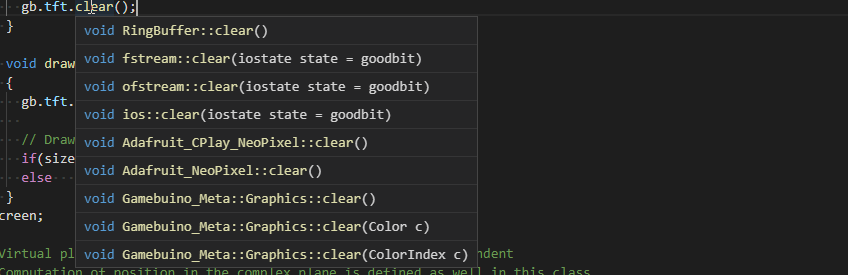

Well. VSCode can be used like this, for sure, but it is far from perfect. Even if the `browse.path` is re-fined to reduce the number of hints, or "defines" are added, the Tag Parser will not understand the semantic of the code. For that, we need the "Default" Intellisense engine.

## Configuration of the Default IntelliSense engine

The Default IntelliSense engine is quite complex and hides many pitfalls because it has to mimic the work of the pre-processor and the compiler, without really compiling the code.

We now need to activate the "Default" engine in the user settings:

- Open _File > Preferences > Settings_, then search for the string _intellisense_
- Set: _C\_Cpp: IntelliSense Engine_: _Default_

Then let's start.

### Basic approach

Basically, we can try to add the same paths as for the Tag Parser. We an `includePath` block in the middle of the JSON file and append `/**` to each path (except our sketch folder) to trigger recursive search:

```json
            "includePath": [
                "${workspaceFolder}",
                "${env:PACKAGES_PATH}/arduino/tools/**",
                "${env:PACKAGES_PATH}/gamebuino/hardware/**",
                "${env:SKETCHBOOK_PATH}/libraries/**"
            ],
```

After a reset of the database, we can see as well the parsing of some files, then the engine seems to be busy with some deferred action:

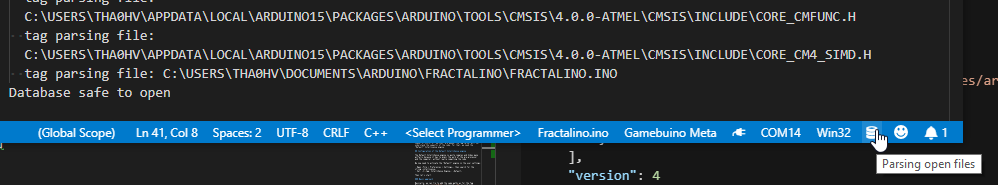

So, keep in mind that the **Default engine takes more time than the Tag Parser**.

We can see immediately the improvement provided by the Default engine:

- The list for auto-completion is much shorter, it shows only the functions or members that belong to the object:
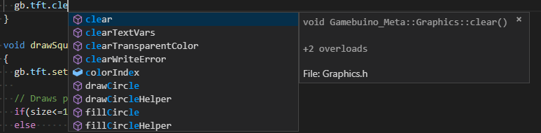

- Same for tool-tips showing e.g. function definition:
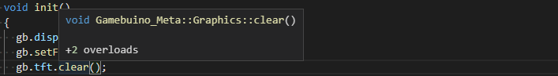

### Compiler query

Now many red squiggles remain. They are very mysterious at this point because standard definitions such as `int16_t` are affected, although the `includePath` variable contains more than enough paths. The Tag Parser would show a long list of definitions to pick from, but the Default engine is not able to find one single definition:

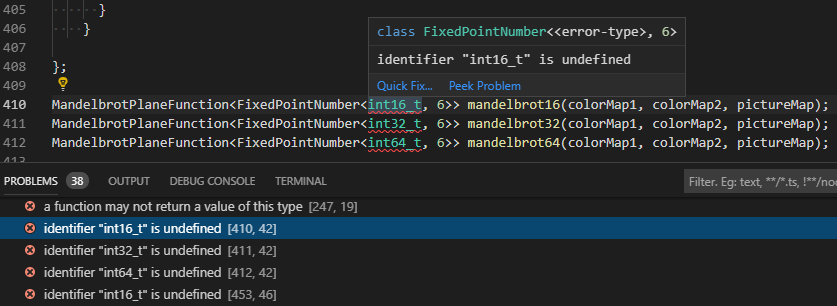

Normally the `int16_t` is defined in `stdint.h`:

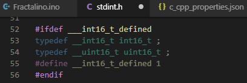

Because the macro `___int16_t_defined` is not defined or known in VSCode, the IntelliSense engine skips the definition of `int16_t` (here highlighted in dark colors). `___int16_t_defined` is, in turn, defined in some other header file and depends on other defines.

Ultimately, we need to have the exhaustive list of defines given to the pre-processor, such that the IntelliSense engine interpret the header files completely. You can refer to [my other tutorial on the Arduino IDE](https://gamebuino.com/index.php/creations/understanding-the-arduino-ide) to see how to list the "pre-defined macros" manually.

The C/C++ extension integrates a function to query the compiler and hence determine not only the set of defines (including pre-defined macros), but also the list of include files. This feature is configured through the `compilerPath` setting, which is set with a value very similar to the command used by the arduino-builder to compile a sketch.

Practically:

- Select _Arduino_ in the drop-down list on the _Output_ pane
- Compile your sketch (assuming verbose output is still turned on otherwise refer to the previous sections)
- Locate the line _Compiling Sketch..._ in the compilation output, and copy the long compiler command located just below _Compiling Sketch..._ (just copy it to the clipboard)
- Go to the `c_cpp_properties.json` editor, activate _View > Toggle Word Wrap_ to see better if you wish
- Add a new `"compilerPath" = "",` line in your `c_cpp_properties.json` file, then paste the text into this line between the pair of double-quotes `""`
- Now **edit the text you just pasted, in order to simplify it and make it executable by VSCode**:
  - On Windows, add "`.exe`" after `bin/arm-none-eabi-g++` (VSCode needs to know the exact full path of the compiler executable), and enclose the complete path between `\"` (escaped double quotes)
  - Remove the path to the file to be compiled `[your-sketch].ino.cpp` and the compiler options `-o [your-sketch].ino.cpp.o` (both at the end of the text)
  - Remove all options starting with `-I` (include files)
  - Simplify and remove the values of the options starting with `-D` (defines) that contain space characters and lots of escaping, e.g. transform `"-D__SKETCH_NAME__=\"\"\"Fractalino.ino\"\"\""` into just `-D__SKETCH_NAME__`
  - On Windows, if you want, replace the `\\` (escape backslash characters) by `/` for readability and portability
  - If you want, replace the absolute paths with references to variables defined in the `env` block
- Before you save the changes, open the _Output_ pane and select _C/C++_ on the drop-down list to see what happens when you save the modifications. Normally you should see line like `Attempting to get defaults from compiler in ...` and no error message if if everything is correctly set up.

Long story short, at the end, the line should look like this:
```json
            "compilerPath": "\"${env:PACKAGES_PATH}/arduino/tools/arm-none-eabi-gcc/4.8.3-2014q1/bin/arm-none-eabi-g++.exe\" -mcpu=cortex-m0plus -mthumb -c -g -Os -w -std=gnu++11 -ffunction-sections -fdata-sections -fno-threadsafe-statics -nostdlib --param max-inline-insns-single=500 -fno-rtti -fno-exceptions -MMD -D__SKETCH_NAME__ -DF_CPU=48000000L -DARDUINO=10808 -DARDUINO_SAMD_ZERO -DARDUINO_ARCH_SAMD -save-temps=obj -D__SAMD21G18A__ -DUSB_VID=0x2341 -DUSB_PID=0x804d -DUSBCON -DUSB_MANUFACTURER -DUSB_PRODUCT",
```

Note that we removed the include files, and simplified some defines. It is of course possible to keep them in the compiler command. The include files will be kept in the path lists `includePath` and `browse.path` for generality (and because I could not find a reliable way to escape file paths with spaces on Windows with the new version of the C/C++ extension!).

Once the JSON file is changed, go to the `.ino` file, and have a look at the _Output_ pane. Normally, you should see the engine run again and display a list of include files e.g. `...\LIB\GCC\ARM-NONE-EABI\4.8.3\INCLUDE-FIXED` and the exhaustive list of defines comprising `define: __STDC__=1` or `define: __cplusplus=201103L`.

At this point, the now known defines allow the IntelliSense engine to correctly interpret the header file:

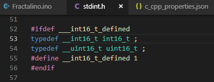

And tool-tips show a perfect result, no more undefined type:

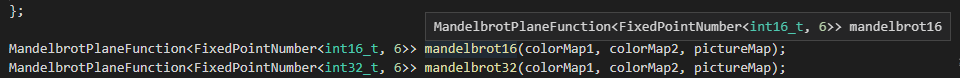

### Re-fining the list of folders

Like for the defines, we can re-work the command in the verbose compilation output (below _Compiling Sketch..._) to make the list of include folders more precise. The exact same list can be used for the `includePath` and `browse.path` blocks, parsed recursively by the Tag parser and not recursively by the Default engine (sufficient because the engine is smart enough to parse correctly the indirectly included files). Replace the blocks in your file as following:

```json
            "includePath": [
                "${workspaceFolder}",
                "${env:PACKAGES_PATH}/arduino/tools/CMSIS/4.5.0/CMSIS/Include",
                "${env:PACKAGES_PATH}/arduino/tools/CMSIS-Atmel/1.1.0/CMSIS/Device/ATMEL",
                "${env:PACKAGES_PATH}/gamebuino/hardware/samd/1.2.1/cores/arduino",
                "${env:PACKAGES_PATH}/gamebuino/hardware/samd/1.2.1/variants/gamebuino_meta",
                "${env:SKETCHBOOK_PATH}/libraries/Gamebuino_META/src",
                "${env:PACKAGES_PATH}/gamebuino/hardware/samd/1.2.1/libraries/SPI"
            ],

            "browse": {
                "path": [
                    "${workspaceFolder}",
                    "${env:PACKAGES_PATH}/arduino/tools/CMSIS/4.5.0/CMSIS/Include",
                    "${env:PACKAGES_PATH}/arduino/tools/CMSIS-Atmel/1.1.0/CMSIS/Device/ATMEL",
                    "${env:PACKAGES_PATH}/gamebuino/hardware/samd/1.2.1/cores/arduino",
                    "${env:PACKAGES_PATH}/gamebuino/hardware/samd/1.2.1/variants/gamebuino_meta",
                    "${env:SKETCHBOOK_PATH}/libraries/Gamebuino_META/src",
                    "${env:PACKAGES_PATH}/gamebuino/hardware/samd/1.2.1/libraries/SPI"
                    ],
                "limitSymbolsToIncludedHeaders": true
            },
```

### Multiple `.ino` files

Traditionally, the Arduino IDE supports additional source code files with the extension `.ino`, which are displayed as tabs in the Arduino Editor (the `.ino` extension is not displayed on the tab titles). Before compilation, all `.ino` files are concatenated on top of the main sketch `.ino` file, and the line `#include <Arduino.h>` is added.

Consequently, the Default engine cannot recognize the included files, because there is no explicit include statement. In addition, as the extra `.ino` files assume that library header files are included, library header files need to be explicitly included too.

Two alternatives:

- Rename all the `.ino` to `.h` and include these files using `#include` in the main `.ino` file
- List all `.ino` files and all used library header files in the `forcedInclude` variable

As an example, the following list of forced includes can be used for [META-Invaders](https://gamebuino.com/creations/meta-invaders), which comprise many extra `.ino`files:

```json
            "forcedInclude": [
                "${env:PACKAGES_PATH}/gamebuino/hardware/samd/1.2.1/cores/arduino/Arduino.h",
                "${env:SKETCHBOOK_PATH}/libraries/Gamebuino_META/src/Gamebuino-Meta.h",
                "nonstandard.ino", "sounds.ino", "Highscore.ino", "images.ino", "specific.ino"
            ]
```

### IntelliSense slowness

For some reasons, the auto-completion and function definition hints may need a very long time to complete (more than 30 seconds), while the icon on bottom-right shows a red flame saying _Parsing open files..._.

This is not clear to me why this happens, and many bug reports exist on similar issues. Resetting or deleting the database does not help.

Nevertheless, the **slowness seems to be linked to the size of the source code**. If the source code contains some big arrays (e.g. trans-coded images), then moving the code into an extra include file may help.

## TLDR - Final file and conclusion

If it was Too Long and you Didn't Read, this is the final version of the `c_cpp_properties.json` file!

At this point, we assume that the Default IntelliSense engine is configured, the path to the Arduino IDE is set in the user preferences, the board is setup for compilation and the sketch is initialized (i.e. `arduino.json` exists).

Copy the file below for Windows into your `.vscode` folder as `c_cpp_properties.json` (or replace its content if the file already exists). Adapt the values of `PACKAGES_PATH` and `SKETCHBOOK_PATH` to other locations if necessary.

In particular, if you are using the Gamebuino-prepared portable version of the Arduino IDE, use: `"PACKAGES_PATH": "${config:arduino.path}/portable/packages"` and `"SKETCHBOOK_PATH": "${config:arduino.path}/portable/sketchbook"`.

```json
{
    "env": {
        "PACKAGES_PATH": "${env:USERPROFILE}/AppData/Local/Arduino15/packages",
        "SKETCHBOOK_PATH": "${env:USERPROFILE}/Documents/Arduino"
    },
    "configurations": [
        {
            "name": "Win32",
            "intelliSenseMode": "gcc-x64",
            "cStandard": "c11",
            "cppStandard": "c++11",

            "compilerPath": "\"${env:PACKAGES_PATH}/arduino/tools/arm-none-eabi-gcc/4.8.3-2014q1/bin/arm-none-eabi-g++.exe\" -mcpu=cortex-m0plus   -mthumb -c -g -Os -w -std=gnu++11 -ffunction-sections -fdata-sections -fno-threadsafe-statics -nostdlib --param max-inline-insns-single=500 -fno-rtti -fno-exceptions -MMD -D__SKETCH_NAME__ -DF_CPU=48000000L -DARDUINO=10808 -DARDUINO_SAMD_ZERO -DARDUINO_ARCH_SAMD -save-temps=obj -D__SAMD21G18A__ -DUSB_VID=0x2341 -DUSB_PID=0x804d -DUSBCON -DUSB_MANUFACTURER -DUSB_PRODUCT",

            "includePath": [
                "${workspaceFolder}", 
                "${env:PACKAGES_PATH}/arduino/tools/CMSIS/4.5.0/CMSIS/Include",
                "${env:PACKAGES_PATH}/arduino/tools/CMSIS-Atmel/1.1.0/CMSIS/Device/ATMEL",
                "${env:PACKAGES_PATH}/gamebuino/hardware/samd/1.2.1/cores/arduino",
                "${env:PACKAGES_PATH}/gamebuino/hardware/samd/1.2.1/variants/gamebuino_meta",
                "${env:SKETCHBOOK_PATH}/libraries/Gamebuino_META/src",
                "${env:PACKAGES_PATH}/gamebuino/hardware/samd/1.2.1/libraries/SPI"
            ],

            "browse": {
                "path": [
                    "${workspaceFolder}",
                    "${env:PACKAGES_PATH}/arduino/tools/CMSIS/4.5.0/CMSIS/Include",
                    "${env:PACKAGES_PATH}/arduino/tools/CMSIS-Atmel/1.1.0/CMSIS/Device/ATMEL",
                    "${env:PACKAGES_PATH}/gamebuino/hardware/samd/1.2.1/cores/arduino",
                    "${env:PACKAGES_PATH}/gamebuino/hardware/samd/1.2.1/variants/gamebuino_meta",
                    "${env:SKETCHBOOK_PATH}/libraries/Gamebuino_META/src",
                    "${env:PACKAGES_PATH}/gamebuino/hardware/samd/1.2.1/libraries/SPI"
                    ],
                "limitSymbolsToIncludedHeaders": true
            },


            "forcedInclude": [
                "${env:PACKAGES_PATH}/gamebuino/hardware/samd/1.2.1/cores/arduino/Arduino.h"
            ]
        }
    ],
    "version": 4
}
```

Finally, don't forget to leave some time to the IntelliSense engine to parse the header files (check the changing icon on the bottom-right).

That's all folks!


Here are some tips for macOS (lower-case m!):

Complete reset of the IntelliSense Database

IntelliSense user databases are located in ~/Library/Application Support/Code/User/workspaceStorage:

$ tree -a ~/Library/Application\ Support/Code/User/workspaceStorage
/Users/steph/Library/Application Support/Code/User/workspaceStorage
└── 82a2b96a83f9401ecbc0e7e3f177d858
    ├── ms-vscode.cpptools
    │   ├── .browse.VC.db
    │   ├── .browse.VC.db-shm
    │   └── .browse.VC.db-wal
    ├── state.vscdb
    └── workspace.json
And the local sketch database is actually located in .vscode/ipch:

$ tree -a sketchname
sketchname
├── .vscode
│   ├── arduino.json
│   ├── c_cpp_properties.json
│   ├── ipch
│   │   └── c7e9a5004e7d31e0
│   │       ├── sketch.ipch
│   │       └── mmap_address.bin
│   └── settings.json
└── sketchname.ino
c_cpp_properties.json configuration file

The environment variable that designates the user space is not USERPROFILE, but HOME :

"env": {
        "PACKAGES_PATH":   "${env:HOME}/Library/Arduino15/packages",
        "SKETCHBOOK_PATH": "${env:HOME}/Arduino"
}
... and I guess it must be the same for Linux!


Thanks again for this tutorial which is really very useful!


